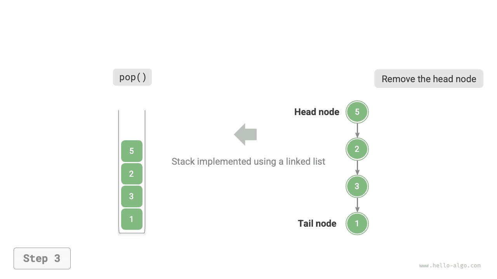
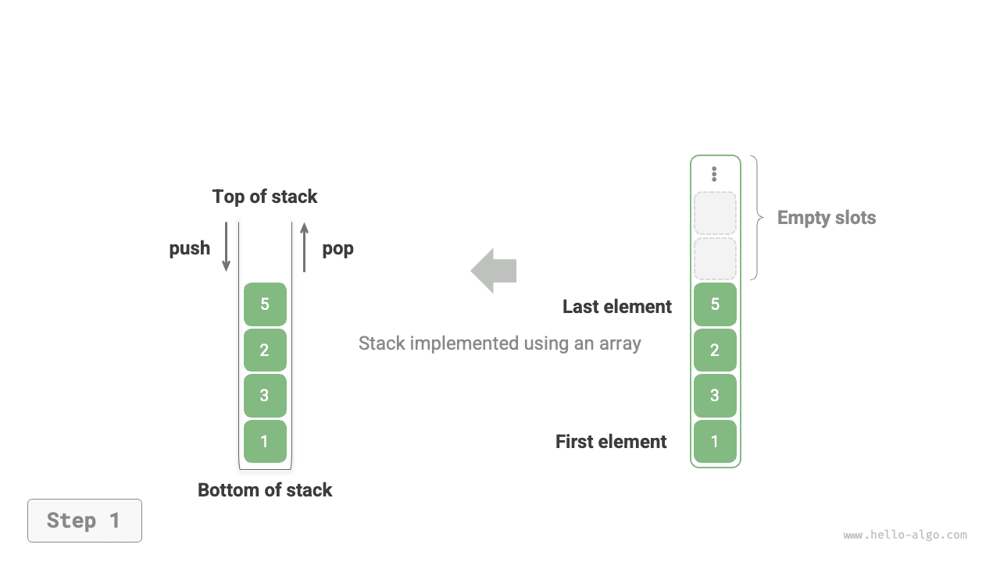

# Ngăn xếp

<u>Ngăn xếp (stack)</u> là một cấu trúc dữ liệu tuyến tính tuân theo nguyên lý vào sau ra trước (LIFO - Last In, First Out).

Chúng ta có thể ví ngăn xếp như một chồng đĩa trên mặt bàn: nếu quy định mỗi lần chỉ được di chuyển một chiếc đĩa, thì muốn lấy chiếc đĩa ở dưới cùng, trước hết phải lần lượt dọn đi những chiếc đĩa ở phía trên. Khi thay thế các chiếc đĩa bằng các kiểu phần tử khác nhau (như số nguyên, ký tự, đối tượng, v.v.), chúng ta thu được cấu trúc dữ liệu ngăn xếp.

Như hình dưới đây, chúng ta gọi phần trên cùng của các phần tử xếp chồng là "đỉnh ngăn xếp" (top), và phần dưới cùng là "đáy ngăn xếp" (bottom). Thao tác thêm phần tử vào đỉnh ngăn xếp được gọi là "đẩy vào" (push), còn thao tác xoá phần tử ở đỉnh ngăn xếp được gọi là "lấy ra" (pop).


## Các thao tác thường dùng trên ngăn xếp

Các thao tác thường dùng trên ngăn xếp được liệt kê trong bảng dưới đây, tên phương thức cụ thể phụ thuộc vào từng ngôn ngữ lập trình. Ở đây, chúng ta lấy quy ước đặt tên phổ biến là `push()`, `pop()`, `peek()` làm ví dụ.

<p align="center"> Bảng <id> &nbsp; Hiệu năng thao tác của ngăn xếp </p>

| Phương thức | Mô tả                   | Độ phức tạp thời gian |
| -------- | ---------------------- | ---------- |
| `push()` | Đẩy phần tử vào ngăn xếp (thêm vào đỉnh) | $O(1)$     |
| `pop()`  | Lấy phần tử đỉnh ra khỏi ngăn xếp           | $O(1)$     |
| `peek()` | Truy cập phần tử ở đỉnh ngăn xếp           | $O(1)$     |

Thông thường, chúng ta có thể sử dụng trực tiếp lớp ngăn xếp có sẵn trong ngôn ngữ lập trình. Tuy nhiên, một số ngôn ngữ có thể không cung cấp sẵn lớp ngăn xếp chuyên dụng, khi đó chúng ta có thể sử dụng "mảng" hoặc "danh sách liên kết" của ngôn ngữ đó để làm ngăn xếp, và bỏ qua các thao tác không liên quan đến logic của ngăn xếp trong chương trình.

=== "Python"

    ```python title="stack.py"
    # Khởi tạo ngăn xếp
    # Python không có lớp stack tích hợp sẵn, có thể dùng list làm ngăn xếp
    stack: list[int] = []

    # Đẩy phần tử vào ngăn xếp
    stack.append(1)
    stack.append(3)
    stack.append(2)
    stack.append(5)
    stack.append(4)

    # Truy cập phần tử đỉnh ngăn xếp
    peek: int = stack[-1]

    # Lấy phần tử ra khỏi ngăn xếp
    pop: int = stack.pop()

    # Lấy độ dài ngăn xếp
    size: int = len(stack)

    # Kiểm tra ngăn xếp có rỗng không
    is_empty: bool = len(stack) == 0
    ```

=== "C++"

    ```cpp title="stack.cpp"
    /* Khởi tạo ngăn xếp */
    stack<int> stack;

    /* Đẩy phần tử vào ngăn xếp */
    stack.push(1);
    stack.push(3);
    stack.push(2);
    stack.push(5);
    stack.push(4);

    /* Truy cập phần tử đỉnh ngăn xếp */
    int top = stack.top();

    /* Lấy phần tử ra khỏi ngăn xếp */
    stack.pop(); // Không có giá trị trả về

    /* Lấy độ dài ngăn xếp */
    int size = stack.size();

    /* Kiểm tra ngăn xếp có rỗng không */
    bool empty = stack.empty();
    ```

=== "Java"

    ```java title="stack.java"
    /* Khởi tạo ngăn xếp */
    Stack<Integer> stack = new Stack<>();

    /* Đẩy phần tử vào ngăn xếp */
    stack.push(1);
    stack.push(3);
    stack.push(2);
    stack.push(5);
    stack.push(4);

    /* Truy cập phần tử đỉnh ngăn xếp */
    int peek = stack.peek();

    /* Lấy phần tử ra khỏi ngăn xếp */
    int pop = stack.pop();

    /* Lấy độ dài ngăn xếp */
    int size = stack.size();

    /* Kiểm tra ngăn xếp có rỗng không */
    boolean isEmpty = stack.isEmpty();
    ```

=== "C#"

    ```csharp title="stack.cs"
    /* Khởi tạo ngăn xếp */
    Stack<int> stack = new();

    /* Đẩy phần tử vào ngăn xếp */
    stack.Push(1);
    stack.Push(3);
    stack.Push(2);
    stack.Push(5);
    stack.Push(4);

    /* Truy cập phần tử đỉnh ngăn xếp */
    int peek = stack.Peek();

    /* Lấy phần tử ra khỏi ngăn xếp */
    int pop = stack.Pop();

    /* Lấy độ dài ngăn xếp */
    int size = stack.Count;

    /* Kiểm tra ngăn xếp có rỗng không */
    bool isEmpty = stack.Count == 0;
    ```

=== "Go"

    ```go title="stack_test.go"
    /* Khởi tạo ngăn xếp */
    // Trong Go, có thể dùng slice làm ngăn xếp
    var stack []int

    /* Đẩy phần tử vào ngăn xếp */
    stack = append(stack, 1)
    stack = append(stack, 3)
    stack = append(stack, 2)
    stack = append(stack, 5)
    stack = append(stack, 4)

    /* Truy cập phần tử đỉnh ngăn xếp */
    peek := stack[len(stack)-1]

    /* Lấy phần tử ra khỏi ngăn xếp */
    pop := stack[len(stack)-1]
    stack = stack[:len(stack)-1]

    /* Lấy độ dài ngăn xếp */
    size := len(stack)

    /* Kiểm tra ngăn xếp có rỗng không */
    isEmpty := len(stack) == 0
    ```

=== "Swift"

    ```swift title="stack.swift"
    /* Khởi tạo ngăn xếp */
    // Trong Swift, có thể dùng Array làm ngăn xếp
    var stack: [Int] = []

    /* Đẩy phần tử vào ngăn xếp */
    stack.append(1)
    stack.append(3)
    stack.append(2)
    stack.append(5)
    stack.append(4)

    /* Truy cập phần tử đỉnh ngăn xếp */
    let peek = stack.last!

    /* Lấy phần tử ra khỏi ngăn xếp */
    let pop = stack.removeLast()

    /* Lấy độ dài ngăn xếp */
    let size = stack.count

    /* Kiểm tra ngăn xếp có rỗng không */
    let isEmpty = stack.isEmpty
    ```

=== "JS"

    ```javascript title="stack.js"
    /* Khởi tạo ngăn xếp */
    // Trong JS, có thể dùng Array làm ngăn xếp
    const stack = [];

    /* Đẩy phần tử vào ngăn xếp */
    stack.push(1);
    stack.push(3);
    stack.push(2);
    stack.push(5);
    stack.push(4);

    /* Truy cập phần tử đỉnh ngăn xếp */
    const peek = stack[stack.length - 1];

    /* Lấy phần tử ra khỏi ngăn xếp */
    const pop = stack.pop();

    /* Lấy độ dài ngăn xếp */
    const size = stack.length;

    /* Kiểm tra ngăn xếp có rỗng không */
    const is_empty = stack.length === 0;
    ```

=== "TS"

    ```typescript title="stack.ts"
    /* Khởi tạo ngăn xếp */
    // Trong TS, có thể dùng Array làm ngăn xếp
    const stack: number[] = [];

    /* Đẩy phần tử vào ngăn xếp */
    stack.push(1);
    stack.push(3);
    stack.push(2);
    stack.push(5);
    stack.push(4);

    /* Truy cập phần tử đỉnh ngăn xếp */
    const peek = stack[stack.length - 1];

    /* Lấy phần tử ra khỏi ngăn xếp */
    const pop = stack.pop();

    /* Lấy độ dài ngăn xếp */
    const size = stack.length;

    /* Kiểm tra ngăn xếp có rỗng không */
    const is_empty = stack.length === 0;
    ```

=== "Dart"

    ```dart title="stack.dart"
    /* Khởi tạo ngăn xếp */
    // Trong Dart, có thể dùng List làm ngăn xếp
    List<int> stack = [];

    /* Đẩy phần tử vào ngăn xếp */
    stack.add(1);
    stack.add(3);
    stack.add(2);
    stack.add(5);
    stack.add(4);

    /* Truy cập phần tử đỉnh ngăn xếp */
    int peek = stack.last;

    /* Lấy phần tử ra khỏi ngăn xếp */
    int pop = stack.removeLast();

    /* Lấy độ dài ngăn xếp */
    int size = stack.length;

    /* Kiểm tra ngăn xếp có rỗng không */
    bool isEmpty = stack.isEmpty;
    ```

=== "Rust"

    ```rust title="stack.rs"
    /* Khởi tạo ngăn xếp */
    // Trong Rust, có thể dùng Vec làm ngăn xếp
    let mut stack: Vec<i32> = Vec::new();

    /* Đẩy phần tử vào ngăn xếp */
    stack.push(1);
    stack.push(3);
    stack.push(2);
    stack.push(5);
    stack.push(4);

    /* Truy cập phần tử đỉnh ngăn xếp */
    let peek = stack.last().unwrap();

    /* Lấy phần tử ra khỏi ngăn xếp */
    let pop = stack.pop().unwrap();

    /* Lấy độ dài ngăn xếp */
    let size = stack.len();

    /* Kiểm tra ngăn xếp có rỗng không */
    let is_empty = stack.is_empty();
    ```

=== "C"

    ```c title="stack.c"
    // C chưa cung cấp cấu trúc ngăn xếp tích hợp sẵn
    ```

=== "Kotlin"

    ```kotlin title="stack.kt"
    /* Khởi tạo ngăn xếp */
    val stack = Stack<Int>()

    /* Đẩy phần tử vào ngăn xếp */
    stack.push(1)
    stack.push(3)
    stack.push(2)
    stack.push(5)
    stack.push(4)

    /* Truy cập phần tử đỉnh ngăn xếp */
    val peek = stack.peek()

    /* Lấy phần tử ra khỏi ngăn xếp */
    val pop = stack.pop()

    /* Lấy độ dài ngăn xếp */
    val size = stack.size

    /* Kiểm tra ngăn xếp có rỗng không */
    val isEmpty = stack.isEmpty()
    ```

=== "Ruby"

    ```ruby title="stack.rb"
    # Khởi tạo ngăn xếp
    # Trong Ruby, có thể dùng Array làm ngăn xếp
    stack = []

    # Đẩy phần tử vào ngăn xếp
    stack.push(1)
    stack.push(3)
    stack.push(2)
    stack.push(5)
    stack.push(4)

    # Truy cập phần tử đỉnh ngăn xếp
    peek = stack.last

    # Lấy phần tử ra khỏi ngăn xếp
    pop = stack.pop

    # Lấy độ dài ngăn xếp
    size = stack.length

    # Kiểm tra ngăn xếp có rỗng không
    is_empty = stack.empty?
    ```

=== "Zig"

    ```zig title="stack.zig"
    // Khởi tạo ngăn xếp
    // Trong Zig, có thể dùng ArrayList làm ngăn xếp
    var stack = std.ArrayList(i32).init(std.heap.page_allocator);
    defer stack.deinit();

    // Đẩy phần tử vào ngăn xếp
    try stack.append(1);
    try stack.append(3);
    try stack.append(2);
    try stack.append(5);
    try stack.append(4);

    // Truy cập phần tử đỉnh ngăn xếp
    const peek = stack.items[stack.items.len - 1];

    // Lấy phần tử ra khỏi ngăn xếp
    const pop = stack.pop();

    // Lấy độ dài ngăn xếp
    const size = stack.items.len;

    // Kiểm tra ngăn xếp có rỗng không
    const is_empty = stack.items.len == 0;
    ```

??? pythontutor "Trực quan hoá thực thi"

    https://pythontutor.com/render.html#code=%22%22%22Driver%20Code%22%22%22%0Aif%20__name__%20%3D%3D%20%22__main__%22%3A%0A%20%20%20%20#%20%E5%88%9D%E5%A7%8B%E5%8C%96%E6%A0%88%0A%20%20%20%20#%20Python%20%E6%B2%A1%E6%9C%89%E5%86%85%E7%BD%AE%E7%9A%84%E6%A0%88%E7%B1%BB%EF%BC%8C%E5%8F%AF%E4%BB%A5%E6%8A%8A%20list%20%E5%BD%93%E4%BD%9C%E6%A0%88%E6%9D%A5%E4%BD%BF%E7%94%A8%0A%20%20%20%20stack%20%3D%20%5B%5D%0A%0A%20%20%20%20#%20%E5%85%83%E7%B4%A0%E5%85%A5%E6%A0%88%0A%20%20%20%20stack.append%281%29%0A%20%20%20%20stack.append%283%29%0A%20%20%20%20stack.append%282%29%0A%20%20%20%20stack.append%285%29%0A%20%20%20%20stack.append%284%29%0A%20%20%20%20print%28%22%E6%A0%88%20stack%20%3D%22,%20stack%29%0A%0A%20%20%20%20#%20%E8%AE%BF%E9%97%AE%E6%A0%88%E9%A1%B6%E5%85%83%E7%B4%A0%0A%20%20%20%20peek%20%3D%20stack%5B-1%5D%0A%20%20%20%20print%28%22%E6%A0%88%E9%A1%B6%E5%85%83%E7%B4%A0%20peek%20%3D%22,%20peek%29%0A%0A%20%20%20%20#%20%E5%85%83%E7%B4%A0%E5%87%BA%E6%A0%88%0A%20%20%20%20pop%20%3D%20stack.pop%28%29%0A%20%20%20%20print%28%22%E5%87%BA%E6%A0%88%E5%85%83%E7%B4%A0%20pop%20%3D%22,%20pop%29%0A%20%20%20%20print%28%22%E5%87%BA%E6%A0%88%E5%90%8E%20stack%20%3D%22,%20stack%29%0A%0A%20%20%20%20#%20%E8%8E%B7%E5%8F%96%E6%A0%88%E7%9A%84%E9%95%BF%E5%BA%A6%0A%20%20%20%20size%20%3D%20len%28stack%29%0A%20%20%20%20print%28%22%E6%A0%88%E7%9A%84%E9%95%BF%E5%BA%A6%20size%20%3D%22,%20size%29%0A%0A%20%20%20%20#%20%E5%88%A4%E6%96%AD%E6%98%AF%E5%90%A6%E4%B8%BA%E7%A9%BA%0A%20%20%20%20is_empty%20%3D%20len%28stack%29%20%3D%3D%200%0A%20%20%20%20print%28%22%E6%A0%88%E6%98%AF%E5%90%A6%E4%B8%BA%E7%A9%BA%20%3D%22,%20is_empty%29&cumulative=false&curInstr=2&heapPrimitives=nevernest&mode=display&origin=opt-frontend.js&py=311&rawInputLstJSON=%5B%5D&textReferences=false

## Hiện thực ngăn xếp

Để tìm hiểu sâu hơn về cơ chế vận hành của ngăn xếp, chúng ta hãy thử tự hiện thực một lớp ngăn xếp.

Ngăn xếp tuân theo nguyên lý vào sau ra trước, do đó chúng ta chỉ có thể thêm hoặc xoá phần tử ở đỉnh ngăn xếp. Tuy nhiên, cả mảng và danh sách liên kết đều có thể thêm và xoá phần tử tại vị trí bất kỳ, **vì vậy ngăn xếp có thể coi như một mảng hoặc danh sách liên kết bị hạn chế quyền thao tác**. Nói cách khác, chúng ta có thể "che giấu" một phần thao tác không liên quan của mảng hoặc danh sách liên kết, để logic thể hiện ra bên ngoài của nó khớp đúng với các đặc tính của ngăn xếp.

### Hiện thực dựa trên danh sách liên kết

Khi sử dụng danh sách liên kết để hiện thực ngăn xếp, chúng ta có thể coi nút đầu của danh sách liên kết là đỉnh ngăn xếp, còn nút cuối là đáy ngăn xếp.

Như minh hoạ trong hình dưới đây, đối với thao tác đẩy vào (push), chúng ta chỉ cần chèn phần tử vào đầu danh sách liên kết, phương pháp chèn nút này được gọi là "chèn đầu" (head insertion). Còn đối với thao tác lấy ra (pop), chỉ cần xoá nút đầu khỏi danh sách liên kết là xong.

=== "<1>"
    

=== "<2>"
    

=== "<3>"
    

Dưới đây là mã nguồn mẫu hiện thực ngăn xếp dựa trên danh sách liên kết:

```src
[file]{linkedlist_stack}-[class]{linked_list_stack}-[func]{}
```

### Hiện thực dựa trên mảng

Khi sử dụng mảng để hiện thực ngăn xếp, chúng ta có thể lấy phần đuôi của mảng làm đỉnh ngăn xếp. Như minh hoạ trong hình dưới đây, thao tác đẩy vào (push) và lấy ra (pop) lần lượt tương ứng với việc thêm phần tử và xoá phần tử ở đuôi mảng, cả hai đều có độ phức tạp thời gian là $O(1)$ 。

=== "<1>"
    

=== "<2>"
    

=== "<3>"
    

Do các phần tử đẩy vào ngăn xếp có thể liên tục tăng lên không ngừng, chúng ta có thể sử dụng mảng động, như vậy sẽ không cần tự tay xử lý vấn đề mở rộng dung lượng mảng. Dưới đây là mã nguồn mẫu:

```src
[file]{array_stack}-[class]{array_stack}-[func]{}
```

## So sánh hai phương thức hiện thực

**Các thao tác hỗ trợ**

Cả hai cách hiện thực đều hỗ trợ đầy đủ các thao tác theo định nghĩa của ngăn xếp. Cách hiện thực bằng mảng hỗ trợ thêm truy cập ngẫu nhiên, nhưng điều này đã vượt ra ngoài phạm vi định nghĩa của ngăn xếp, do đó thông thường sẽ không dùng đến.

**Hiệu năng thời gian**

Trong cách hiện thực dựa trên mảng, các thao tác đẩy vào và lấy ra đều diễn ra trong vùng nhớ liên tục được cấp phát sẵn, có tính cục bộ bộ nhớ đệm (cache locality) rất tốt, vì vậy hiệu năng cao hơn. Tuy nhiên, nếu khi đẩy vào mà vượt quá sức chứa của mảng, cơ chế mở rộng dung lượng sẽ được kích hoạt, khiến độ phức tạp thời gian của thao tác đẩy vào lần đó trở thành $O(n)$ 。

Trong cách hiện thực dựa trên danh sách liên kết, việc mở rộng dung lượng của danh sách liên kết diễn ra rất linh hoạt, không gặp phải vấn đề suy giảm hiệu năng do mở rộng mảng như trên. Tuy nhiên, thao tác đẩy vào cần phải khởi tạo đối tượng nút và sửa đổi con trỏ, nên hiệu năng tương đối thấp hơn. Dù vậy, nếu bản thân các phần tử đẩy vào đã là đối tượng nút, chúng ta có thể bỏ qua bước khởi tạo, nhờ đó nâng cao hiệu năng.

Tóm lại, khi các phần tử của thao tác đẩy vào và lấy ra là các kiểu dữ liệu cơ bản như `int` hoặc `double` ，chúng ta có thể rút ra kết luận sau:

- Ngăn xếp hiện thực dựa trên mảng sẽ bị giảm hiệu năng khi kích hoạt mở rộng dung lượng, nhưng vì việc mở rộng là thao tác có tần suất thấp, nên hiệu năng trung bình sẽ cao hơn.
- Ngăn xếp hiện thực dựa trên danh sách liên kết có thể đem lại hiệu năng ổn định hơn.

**Hiệu năng không gian**

Khi khởi tạo danh sách (mảng động), hệ thống sẽ cấp phát một "dung lượng ban đầu", dung lượng này có thể vượt quá nhu cầu thực tế; đồng thời cơ chế mở rộng thường nhân theo một tỉ lệ nhất định (ví dụ gấp 2 lần), dung lượng sau khi mở rộng cũng có thể dư thừa so với nhu cầu. Do đó, **ngăn xếp hiện thực dựa trên mảng có thể gây lãng phí một lượng không gian nhất định**.

Tuy nhiên, do các nút danh sách liên kết cần phải lưu thêm con trỏ, **nên không gian mà các nút danh sách liên kết chiếm dụng là tương đối lớn**.

Tổng kết lại, chúng ta không thể khẳng định một cách đơn giản phương thức hiện thực nào tiết kiệm bộ nhớ hơn, mà cần phân tích cụ thể theo từng tình huống.

## Các ứng dụng điển hình của ngăn xếp

- **Thao tác lùi lại (Back) và tiến tới (Forward) trong trình duyệt, hoàn tác (Undo) và làm lại (Redo) trong phần mềm**: Mỗi khi mở một trang web mới, trình duyệt sẽ đẩy trang web trước đó vào ngăn xếp, nhờ đó chúng ta có thể quay lại trang web trước thông qua thao tác lùi lại. Thao tác lùi lại thực chất là đang thực hiện lấy ra khỏi ngăn xếp (pop). Nếu muốn hỗ trợ đồng thời cả lùi lại và tiến tới, cần phải phối hợp hai ngăn xếp cùng lúc.
- **Quản lý bộ nhớ chương trình**: Mỗi khi gọi một hàm, hệ thống đều sẽ thêm một khung ngăn xếp (stack frame) vào đỉnh ngăn xếp cuộc gọi để ghi lại thông tin ngữ cảnh của hàm. Trong hàm đệ quy, giai đoạn truyền đệ quy đi xuống sẽ liên tục thực hiện thao tác đẩy vào (push), còn giai đoạn hồi quy quay ngược lên sẽ liên tục thực hiện thao tác lấy ra (pop).
