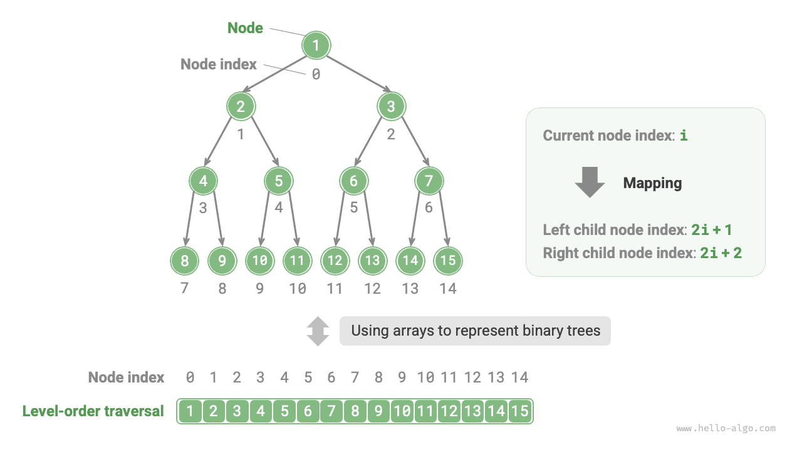
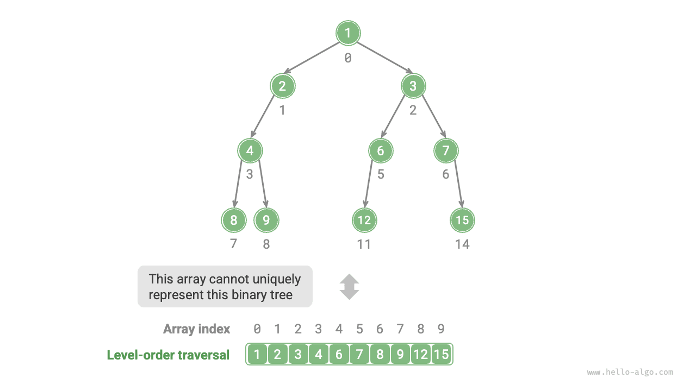
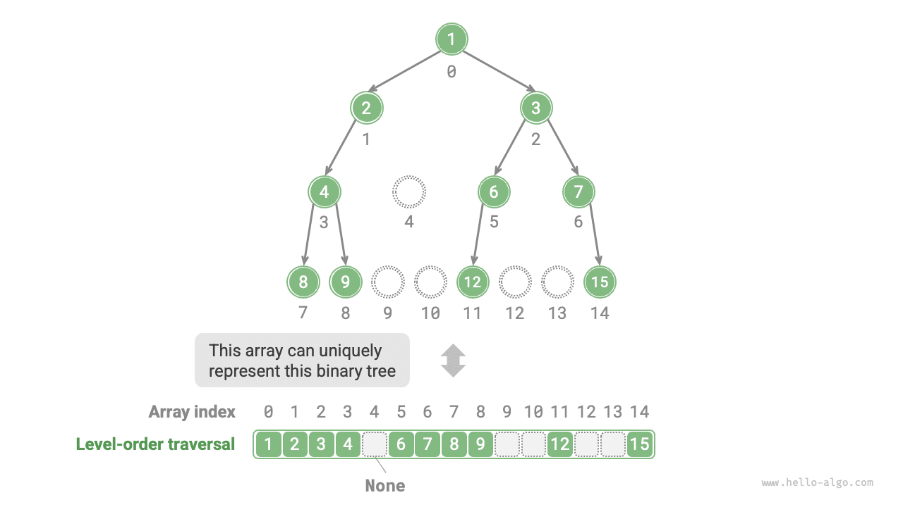

# Biểu diễn cây nhị phân bằng mảng

Trong cách biểu diễn bằng danh sách liên kết, đơn vị lưu trữ của cây nhị phân là nút `TreeNode`, các nút được kết nối với nhau thông qua con trỏ. Các phần trước đã giới thiệu các thao tác cơ bản của cây nhị phân dưới cách biểu diễn bằng danh sách liên kết.

Vậy chúng ta có thể dùng mảng để biểu diễn cây nhị phân hay không? Câu trả lời là hoàn toàn có thể.

## Biểu diễn cây nhị phân hoàn hảo

Trước tiên hãy phân tích một ví dụ đơn giản. Cho một cây nhị phân hoàn hảo, chúng ta lưu trữ toàn bộ các nút vào trong một mảng theo thứ tự duyệt theo tầng, khi đó mỗi nút đều tương ứng với một chỉ số mảng duy nhất.

Dựa theo đặc tính của duyệt theo tầng, chúng ta có thể suy ra "công thức ánh xạ" giữa chỉ số nút cha và chỉ số các nút con: **Nếu chỉ số của một nút là $i$, thì chỉ số nút con trái của nó là $2i + 1$, và chỉ số nút con phải là $2i + 2$**. Hình dưới đây minh hoạ mối quan hệ ánh xạ giữa các chỉ số của từng nút.



**Vai trò của công thức ánh xạ tương đương với các tham chiếu (con trỏ) nút trong danh sách liên kết**. Với một nút bất kỳ trong mảng, chúng ta đều có thể truy cập nút con trái (phải) của nó thông qua công thức ánh xạ này.

## Biểu diễn cây nhị phân bất kỳ

Cây nhị phân hoàn hảo là một trường hợp đặc biệt, ở các tầng trung gian của cây nhị phân thông thường sẽ tồn tại nhiều giá trị `None` (hoặc rỗng). Do chuỗi duyệt theo tầng không bao gồm các giá trị `None` này, nên chúng ta không thể chỉ dựa vào chuỗi đó để suy đoán số lượng và vị trí phân bố của `None`. **Điều này đồng nghĩa với việc tồn tại nhiều cấu trúc cây nhị phân khác nhau cùng cho ra một chuỗi duyệt theo tầng duy nhất**.

Như minh hoạ trong hình dưới đây, đối với một cây nhị phân không hoàn hảo, phương pháp biểu diễn bằng mảng nêu trên sẽ không còn hiệu quả.



Để giải quyết vấn đề này, **chúng ta có thể cân nhắc ghi rõ toàn bộ các giá trị `None` vào trong chuỗi duyệt theo tầng**. Như hình dưới đây, sau khi xử lý như vậy, chuỗi duyệt theo tầng đã có thể biểu diễn duy nhất một cây nhị phân. Mã nguồn ví dụ như sau:

=== "Python"

    ```python title=""
    # Biểu diễn cây nhị phân bằng mảng
    # Sử dụng None để biểu thị ô trống
    tree = [1, 2, 3, 4, None, 6, 7, 8, 9, None, None, 12, None, None, 15]
    ```

=== "C++"

    ```cpp title=""
    /* Biểu diễn cây nhị phân bằng mảng */
    // Sử dụng giá trị int lớn nhất INT_MAX để đánh dấu ô trống
    vector<int> tree = {1, 2, 3, 4, INT_MAX, 6, 7, 8, 9, INT_MAX, INT_MAX, 12, INT_MAX, INT_MAX, 15};
    ```

=== "Java"

    ```java title=""
    /* Biểu diễn cây nhị phân bằng mảng */
    // Sử dụng lớp bao gói Integer của kiểu int, có thể dùng null để đánh dấu ô trống
    Integer[] tree = { 1, 2, 3, 4, null, 6, 7, 8, 9, null, null, 12, null, null, 15 };
    ```

=== "C#"

    ```csharp title=""
    /* Biểu diễn cây nhị phân bằng mảng */
    // Sử dụng kiểu dữ liệu int? (nullable), có thể dùng null để đánh dấu ô trống
    int?[] tree = [1, 2, 3, 4, null, 6, 7, 8, 9, null, null, 12, null, null, 15];
    ```

=== "Go"

    ```go title=""
    /* Biểu diễn cây nhị phân bằng mảng */
    // Sử dụng slice kiểu any, có thể dùng nil để đánh dấu ô trống
    tree := []any{1, 2, 3, 4, nil, 6, 7, 8, 9, nil, nil, 12, nil, nil, 15}
    ```

=== "Swift"

    ```swift title=""
    /* Biểu diễn cây nhị phân bằng mảng */
    // Sử dụng kiểu Int? (nullable), có thể dùng nil để đánh dấu ô trống
    let tree: [Int?] = [1, 2, 3, 4, nil, 6, 7, 8, 9, nil, nil, 12, nil, nil, 15]
    ```

=== "JS"

    ```javascript title=""
    /* Biểu diễn cây nhị phân bằng mảng */
    // Sử dụng null để biểu thị ô trống
    let tree = [1, 2, 3, 4, null, 6, 7, 8, 9, null, null, 12, null, null, 15];
    ```

=== "TS"

    ```typescript title=""
    /* Biểu diễn cây nhị phân bằng mảng */
    // Sử dụng null để biểu thị ô trống
    let tree: (number | null)[] = [1, 2, 3, 4, null, 6, 7, 8, 9, null, null, 12, null, null, 15];
    ```

=== "Dart"

    ```dart title=""
    /* Biểu diễn cây nhị phân bằng mảng */
    // Sử dụng kiểu int? (nullable), có thể dùng null để đánh dấu ô trống
    List<int?> tree = [1, 2, 3, 4, null, 6, 7, 8, 9, null, null, 12, null, null, 15];
    ```

=== "Rust"

    ```rust title=""
    /* Biểu diễn cây nhị phân bằng mảng */
    // Sử dụng None để đánh dấu ô trống
    let tree = [Some(1), Some(2), Some(3), Some(4), None, Some(6), Some(7), Some(8), Some(9), None, None, Some(12), None, None, Some(15)];
    ```

=== "C"

    ```c title=""
    /* Biểu diễn cây nhị phân bằng mảng */
    // Sử dụng giá trị int lớn nhất để đánh dấu ô trống, vì vậy yêu cầu giá trị nút không được bằng INT_MAX
    int tree[] = {1, 2, 3, 4, INT_MAX, 6, 7, 8, 9, INT_MAX, INT_MAX, 12, INT_MAX, INT_MAX, 15};
    ```

=== "Kotlin"

    ```kotlin title=""
    /* Biểu diễn cây nhị phân bằng mảng */
    // Sử dụng null để biểu thị ô trống
    val tree = arrayOf( 1, 2, 3, 4, null, 6, 7, 8, 9, null, null, 12, null, null, 15 )
    ```

=== "Ruby"

    ```ruby title=""
    ### Biểu diễn cây nhị phân bằng mảng ###
    # Sử dụng nil để biểu thị ô trống
    tree = [1, 2, 3, 4, nil, 6, 7, 8, 9, nil, nil, 12, nil, nil, 15]
    ```



Đáng chú ý là, **cây nhị phân hoàn chỉnh cực kỳ thích hợp để biểu diễn bằng mảng**. Nhắc lại định nghĩa về cây nhị phân hoàn chỉnh, các `None` chỉ xuất hiện ở tầng dưới cùng và nằm lệch về phía bên phải, **do đó mọi `None` chắc chắn đều xuất hiện ở cuối chuỗi duyệt theo tầng**.

Điều này đồng nghĩa với việc khi dùng mảng biểu diễn cây nhị phân hoàn chỉnh, ta có thể bỏ qua không cần lưu trữ toàn bộ các `None` này, vô cùng tiện lợi. Hình dưới đây đưa ra một ví dụ:


Mã nguồn dưới đây hiện thực một cây nhị phân dựa trên cách biểu diễn bằng mảng, bao gồm các thao tác sau:

- Cho một nút bất kỳ, lấy giá trị của nó, nút con trái (phải) và nút cha.
- Lấy chuỗi duyệt tiền thứ tự, trung thứ tự, hậu thứ tự và duyệt theo tầng.

```src
[file]{array_binary_tree}-[class]{array_binary_tree}-[func]{}
```

## Ưu điểm và hạn chế

Cách biểu diễn cây nhị phân bằng mảng chủ yếu sở hữu các ưu điểm sau:

- Mảng được lưu trữ trong không gian bộ nhớ liên tục, thân thiện với bộ nhớ đệm (cache-friendly), tốc độ truy cập và duyệt rất nhanh.
- Không cần lưu trữ các con trỏ, tiết kiệm không gian bộ nhớ.
- Cho phép truy cập ngẫu nhiên đến các nút.

Tuy nhiên, biểu diễn bằng mảng cũng tồn tại một số hạn chế:

- Lưu trữ mảng đòi hỏi không gian bộ nhớ liên tục, do đó không thích hợp để lưu trữ cây có lượng dữ liệu quá lớn.
- Thao tác thêm, xoá nút cần thực hiện thông qua thao tác chèn và xoá của mảng, hiệu năng tương đối thấp.
- Khi cây nhị phân có chứa lượng lớn `None`, tỷ lệ dữ liệu nút thực sự trong mảng sẽ thấp, dẫn đến hiệu suất sử dụng không gian kém.
