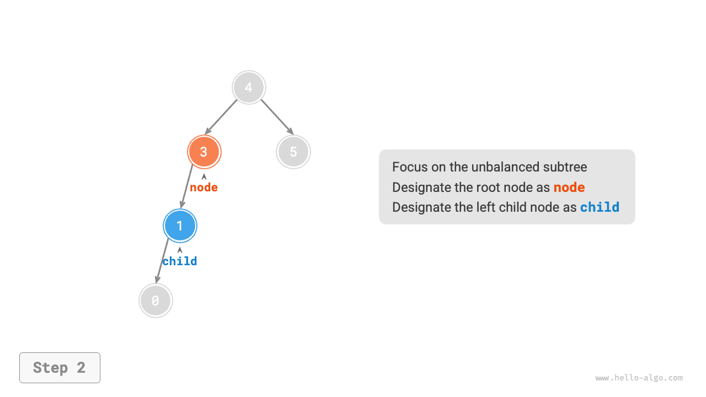
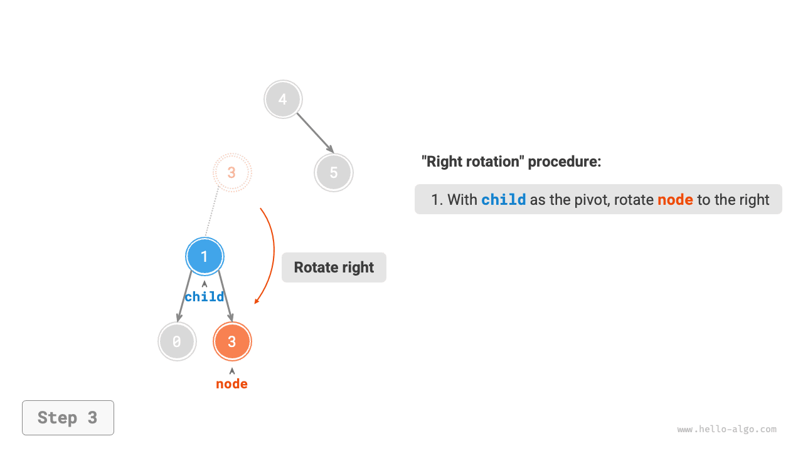
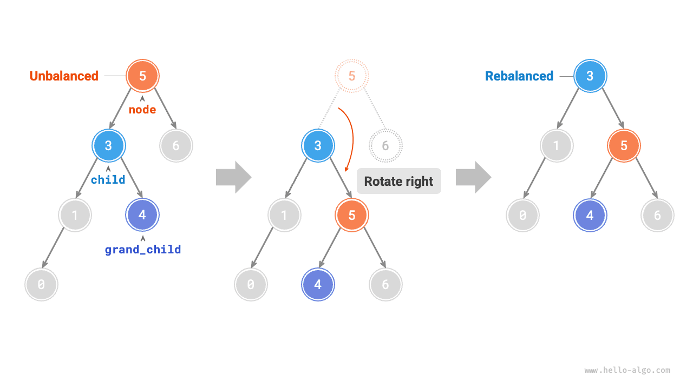
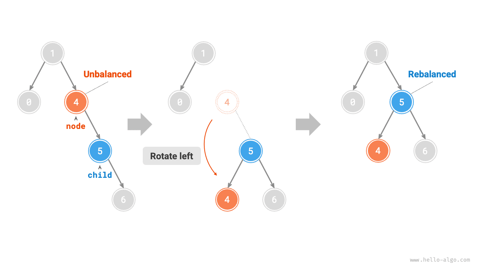

# Cây AVL *

Trong phần "Cây tìm kiếm nhị phân" chúng ta đã đề cập, sau nhiều lần thực hiện thao tác chèn và xoá, cây tìm kiếm nhị phân có thể bị thoái hoá thành danh sách liên kết. Trong trường hợp đó, độ phức tạp thời gian của tất cả các thao tác sẽ suy giảm từ $O(\log n)$ về $O(n)$.

Như minh hoạ trong hình dưới đây, sau hai lần thực hiện thao tác xoá nút, cây tìm kiếm nhị phân này sẽ thoái hoá thành danh sách liên kết.


Lại ví dụ khác, sau khi chèn hai nút vào cây nhị phân hoàn hảo như hình dưới đây, cây sẽ bị lệch nghiêm trọng về bên trái, độ phức tạp thời gian của thao tác tìm kiếm cũng theo đó mà suy giảm.


Năm 1962, G. M. Adelson-Velsky và E. M. Landis đã đề xuất <u>cây AVL</u> trong bài báo khoa học "An algorithm for the organization of information". Bài báo đã mô tả chi tiết một chuỗi các thao tác đảm bảo cây AVL không bị thoái hoá sau khi liên tục thêm và xoá các nút, nhờ đó giữ cho độ phức tạp thời gian của các thao tác luôn duy trì ở mức $O(\log n)$. Nói cách khác, trong những tình huống đòi hỏi phải thực hiện các thao tác thêm, xoá, sửa, tra cứu với tần suất cao, cây AVL luôn duy trì được hiệu năng xử lý dữ liệu vượt trội, mang lại giá trị ứng dụng rất lớn.

## Thuật ngữ thường gặp của cây AVL

Cây AVL vừa là cây tìm kiếm nhị phân, vừa là cây nhị phân cân bằng, đồng thời thoả mãn mọi tính chất của cả hai loại cây này, do đó nó là một <u>cây tìm kiếm nhị phân cân bằng (balanced binary search tree)</u>.

### Chiều cao của nút

Do các thao tác liên quan trên cây AVL đòi hỏi phải lấy được chiều cao của nút, nên chúng ta cần thêm biến `height` vào trong lớp nút:

=== "Python"

    ```python title=""
    class TreeNode:
        """Lớp nút cây AVL"""
        def __init__(self, val: int):
            self.val: int = val                 # Giá trị nút
            self.height: int = 0                # Chiều cao nút
            self.left: TreeNode | None = None   # Tham chiếu đến nút con trái
            self.right: TreeNode | None = None  # Tham chiếu đến nút con phải
    ```

=== "C++"

    ```cpp title=""
    /* Cấu trúc nút cây AVL */
    struct TreeNode {
        int val{};          // Giá trị nút
        int height = 0;     // Chiều cao nút
        TreeNode *left{};   // Con trỏ đến nút con trái
        TreeNode *right{};  // Con trỏ đến nút con phải
        TreeNode() = default;
        explicit TreeNode(int x) : val(x){}
    };
    ```

=== "Java"

    ```java title=""
    /* Lớp nút cây AVL */
    class TreeNode {
        public int val;        // Giá trị nút
        public int height;     // Chiều cao nút
        public TreeNode left;  // Tham chiếu đến nút con trái
        public TreeNode right; // Tham chiếu đến nút con phải
        public TreeNode(int x) { val = x; }
    }
    ```

=== "C#"

    ```csharp title=""
    /* Lớp nút cây AVL */
    class TreeNode(int? x) {
        public int? val = x;    // Giá trị nút
        public int height;      // Chiều cao nút
        public TreeNode? left;  // Tham chiếu đến nút con trái
        public TreeNode? right; // Tham chiếu đến nút con phải
    }
    ```

=== "Go"

    ```go title=""
    /* Cấu trúc nút cây AVL */
    type TreeNode struct {
        Val    int       // Giá trị nút
        Height int       // Chiều cao nút
        Left   *TreeNode // Con trỏ đến nút con trái
        Right  *TreeNode // Con trỏ đến nút con phải
    }
    ```

=== "Swift"

    ```swift title=""
    /* Lớp nút cây AVL */
    class TreeNode {
        var val: Int // Giá trị nút
        var height: Int // Chiều cao nút
        var left: TreeNode? // Tham chiếu đến nút con trái
        var right: TreeNode? // Tham chiếu đến nút con phải

        init(x: Int) {
            val = x
            height = 0
        }
    }
    ```

=== "JS"

    ```javascript title=""
    /* Lớp nút cây AVL */
    class TreeNode {
        val; // Giá trị nút
        height; // Chiều cao nút
        left; // Con trỏ đến nút con trái
        right; // Con trỏ đến nút con phải
        constructor(val, left, right, height) {
            this.val = val === undefined ? 0 : val;
            this.height = height === undefined ? 0 : height;
            this.left = left === undefined ? null : left;
            this.right = right === undefined ? null : right;
        }
    }
    ```

=== "TS"

    ```typescript title=""
    /* Lớp nút cây AVL */
    class TreeNode {
        val: number;            // Giá trị nút
        height: number;         // Chiều cao nút
        left: TreeNode | null;  // Con trỏ đến nút con trái
        right: TreeNode | null; // Con trỏ đến nút con phải
        constructor(val?: number, height?: number, left?: TreeNode | null, right?: TreeNode | null) {
            this.val = val === undefined ? 0 : val;
            this.height = height === undefined ? 0 : height;
            this.left = left === undefined ? null : left;
            this.right = right === undefined ? null : right;
        }
    }
    ```

=== "Dart"

    ```dart title=""
    /* Lớp nút cây AVL */
    class TreeNode {
      int val;         // Giá trị nút
      int height;      // Chiều cao nút
      TreeNode? left;  // Tham chiếu đến nút con trái
      TreeNode? right; // Tham chiếu đến nút con phải
      TreeNode(this.val, [this.height = 0, this.left, this.right]);
    }
    ```

=== "Rust"

    ```rust title=""
    use std::rc::Rc;
    use std::cell::RefCell;

    /* Cấu trúc nút cây AVL */
    struct TreeNode {
        val: i32,                               // Giá trị nút
        height: i32,                            // Chiều cao nút
        left: Option<Rc<RefCell<TreeNode>>>,    // Tham chiếu đến nút con trái
        right: Option<Rc<RefCell<TreeNode>>>,   // Tham chiếu đến nút con phải
    }

    impl TreeNode {
        /* Hàm khởi tạo */
        fn new(val: i32) -> Rc<RefCell<Self>> {
            Rc::new(RefCell::new(Self {
                val,
                height: 0,
                left: None,
                right: None
            }))
        }
    }
    ```

=== "C"

    ```c title=""
    /* Cấu trúc nút cây AVL */
    typedef struct TreeNode {
        int val;
        int height;
        struct TreeNode *left;
        struct TreeNode *right;
    } TreeNode;

    /* Hàm khởi tạo */
    TreeNode *newTreeNode(int val) {
        TreeNode *node;

        node = (TreeNode *)malloc(sizeof(TreeNode));
        node->val = val;
        node->height = 0;
        node->left = NULL;
        node->right = NULL;
        return node;
    }
    ```

=== "Kotlin"

    ```kotlin title=""
    /* Lớp nút cây AVL */
    class TreeNode(val _val: Int) {  // Giá trị nút
        var height: Int = 0          // Chiều cao nút
        var left: TreeNode? = null   // Tham chiếu đến nút con trái
        var right: TreeNode? = null  // Tham chiếu đến nút con phải
    }
    ```

=== "Ruby"

    ```ruby title=""
    ### Lớp nút cây AVL ###
    class TreeNode
      attr_accessor :val    # Giá trị nút
      attr_accessor :height # Chiều cao nút
      attr_accessor :left   # Tham chiếu đến nút con trái
      attr_accessor :right  # Tham chiếu đến nút con phải

      def initialize(val)
        @val = val
        @height = 0
      end
    end
    ```

"Chiều cao của nút" là khoảng cách từ nút đó đến nút lá xa nhất của nó, tức là số lượng "cạnh" đi qua. Cần đặc biệt lưu ý rằng chiều cao của nút lá là $0$, còn chiều cao của nút rỗng (nút `None`) là $-1$. Chúng ta sẽ tạo hai hàm tiện ích để lần lượt lấy và cập nhật chiều cao của nút:

```src
[file]{avl_tree}-[class]{avl_tree}-[func]{update_height}
```

### Hệ số cân bằng của nút

<u>Hệ số cân bằng (balance factor)</u> của một nút được định nghĩa là chiều cao của cây con trái trừ đi chiều cao của cây con phải của nút đó, đồng thời quy định hệ số cân bằng của nút rỗng là $0$. Chúng ta cũng đóng gói chức năng lấy hệ số cân bằng của nút thành một hàm để thuận tiện sử dụng về sau:

```src
[file]{avl_tree}-[class]{avl_tree}-[func]{balance_factor}
```

!!! tip

    Đặt hệ số cân bằng là $f$, thì trong một cây AVL, hệ số cân bằng của bất kỳ nút nào cũng đều thoả mãn $-1 \le f \le 1$.

## Phép quay cây AVL

Đặc điểm cốt lõi của cây AVL nằm ở các thao tác "quay", nó có khả năng đưa nút mất cân bằng trở lại trạng thái cân bằng mà không làm ảnh hưởng đến chuỗi duyệt trung thứ tự của cây nhị phân. Nói cách khác, **thao tác quay vừa giữ nguyên tính chất "cây tìm kiếm nhị phân", vừa giúp cây trở lại thành "cây nhị phân cân bằng"**.

Chúng ta gọi các nút có giá trị tuyệt đối của hệ số cân bằng $> 1$ là "nút mất cân bằng". Tuỳ theo tình huống mất cân bằng cụ thể của nút, thao tác quay được chia thành bốn loại: quay phải, quay trái, quay trái-phải và quay phải-trái. Dưới đây là phần giới thiệu chi tiết về các thao tác quay này.

### Quay phải (Right Rotation)

Như minh hoạ trong hình dưới đây, các con số bên dưới mỗi nút là hệ số cân bằng của nút đó. Nhìn từ đáy lên đỉnh, nút mất cân bằng đầu tiên trong cây nhị phân là "nút 3". Chúng ta tập trung vào cây con lấy nút mất cân bằng này làm nút gốc, ghi nhận nút này là `node`, nút con trái của nó là `child`, và thực hiện thao tác "quay phải". Sau khi hoàn thành quay phải, cây con khôi phục lại trạng thái cân bằng và vẫn duy trì nguyên vẹn tính chất cây tìm kiếm nhị phân.

=== "<1>"
    

=== "<2>"
    

=== "<3>"
    

=== "<4>"
    

Như minh hoạ trong hình dưới đây, khi nút `child` có nút con phải (ghi nhận là `grand_child`), cần bổ sung thêm một bước trong thao tác quay phải: chuyển `grand_child` thành nút con trái của `node`.



"Quay sang phải" là một cách diễn đạt mang tính hình tượng hoá, thực chất trong lập trình nó được hiện thực thông qua việc sửa đổi các con trỏ nút, mã nguồn như sau:

```src
[file]{avl_tree}-[class]{avl_tree}-[func]{right_rotate}
```

### Quay trái (Left Rotation)

Tương ứng, nếu xét trường hợp "đối xứng gương" của cây nhị phân mất cân bằng nêu trên, chúng ta cần thực hiện thao tác "quay trái" như hình dưới đây:



Tương tự, như hình dưới đây, khi nút `child` có nút con trái (ghi nhận là `grand_child`), cần bổ sung thêm một bước trong thao tác quay trái: chuyển `grand_child` thành nút con phải của `node`.


Có thể nhận thấy rằng, **thao tác quay phải và quay trái về mặt logic là đối xứng gương của nhau, và hai trường hợp mất cân bằng mà chúng xử lý cũng hoàn toàn đối xứng**. Dựa vào tính đối xứng này, chúng ta chỉ cần thay thế toàn bộ `left` thành `right` và toàn bộ `right` thành `left` trong mã nguồn hiện thực quay phải là thu được mã nguồn của quay trái:

```src
[file]{avl_tree}-[class]{avl_tree}-[func]{left_rotate}
```

### Quay trái-phải (Left-Right Rotation)

Đối với nút mất cân bằng 3 trong hình dưới đây, nếu chỉ dùng quay trái hoặc quay phải đơn thuần thì không thể giúp cây con khôi phục trạng thái cân bằng. Lúc này cần phải thực hiện "quay trái" trên nút `child` trước, rồi sau đó mới thực hiện "quay phải" trên nút `node`.


### Quay phải-trái (Right-Left Rotation)

Như minh hoạ trong hình dưới đây, đối với trường hợp đối xứng gương của cây nhị phân mất cân bằng nêu trên, cần phải thực hiện "quay phải" trên nút `child` trước, rồi sau đó mới thực hiện "quay trái" trên nút `node`.


### Lựa chọn phép quay phù hợp

Bốn trường hợp mất cân bằng thể hiện trong hình dưới đây tương ứng 1:1 với các ví dụ nêu trên, lần lượt cần áp dụng các thao tác: quay phải, quay trái-phải, quay phải-trái và quay trái.


Như bảng dưới đây, chúng ta xác định nút mất cân bằng thuộc trường hợp nào trong hình trên bằng cách kiểm tra dấu của hệ số cân bằng tại nút mất cân bằng và tại nút con ở phía cao hơn.

<p align="center"> Bảng <id> &nbsp; Điều kiện lựa chọn bốn phương thức quay </p>

| Hệ số cân bằng của nút mất cân bằng | Hệ số cân bằng của nút con | Phương pháp quay cần áp dụng |
| ------------------ | ---------------- | ---------------- |
| $> 1$ (Cây lệch trái)   | $\geq 0$         | Quay phải             |
| $> 1$ (Cây lệch trái)   | $<0$             | Quay trái-phải     |
| $< -1$ (Cây lệch phải)  | $\leq 0$         | Quay trái             |
| $< -1$ (Cây lệch phải)  | $>0$             | Quay phải-trái     |

Để thuận tiện sử dụng, chúng ta đóng gói toàn bộ logic quay thành một hàm thống nhất. **Có hàm này rồi, chúng ta có thể thực hiện phép quay tương ứng cho mọi trường hợp mất cân bằng, đưa nút mất cân bằng trở lại trạng thái cân bằng**. Mã nguồn như sau:

```src
[file]{avl_tree}-[class]{avl_tree}-[func]{rotate}
```

## Các thao tác thường dùng trên cây AVL

### Chèn nút

Thao tác chèn nút trên cây AVL về cơ bản tương tự như trên cây tìm kiếm nhị phân. Điểm khác biệt duy nhất là sau khi chèn nút vào cây AVL, trên đường đi từ nút đó lên đến nút gốc có thể xuất hiện một chuỗi các nút bị mất cân bằng. Do đó, **chúng ta cần bắt đầu từ nút vừa chèn, đi ngược từ dưới lên trên để thực hiện thao tác quay, giúp khôi phục trạng thái cân bằng cho toàn bộ các nút bị mất cân bằng**. Mã nguồn như sau:

```src
[file]{avl_tree}-[class]{avl_tree}-[func]{insert_helper}
```

### Xoá nút

Tương tự, dựa trên nền tảng của phương thức xoá nút trên cây tìm kiếm nhị phân, sau khi xoá nút cần phải duyệt từ đáy lên đỉnh để thực hiện thao tác quay, khôi phục trạng thái cân bằng cho mọi nút bị mất cân bằng. Mã nguồn như sau:

```src
[file]{avl_tree}-[class]{avl_tree}-[func]{remove_helper}
```

### Tìm kiếm nút

Thao tác tìm kiếm nút trên cây AVL hoàn toàn giống hệt như trên cây tìm kiếm nhị phân, ở đây không nhắc lại nữa.

## Các ứng dụng tiêu biểu của cây AVL

- Tổ chức và lưu trữ các tập dữ liệu lớn, đặc biệt thích hợp cho các tình huống tìm kiếm với tần suất cao nhưng ít khi thêm hoặc xoá.
- Dùng để xây dựng hệ thống chỉ mục trong cơ sở dữ liệu.
- Cây đỏ-đen cũng là một loại cây tìm kiếm nhị phân cân bằng phổ biến. So với cây AVL, điều kiện cân bằng của cây đỏ-đen nới lỏng hơn, số lượng thao tác quay cần thực hiện khi chèn và xoá nút ít hơn, do đó hiệu năng trung bình của các thao tác thêm và xoá nút sẽ cao hơn.
