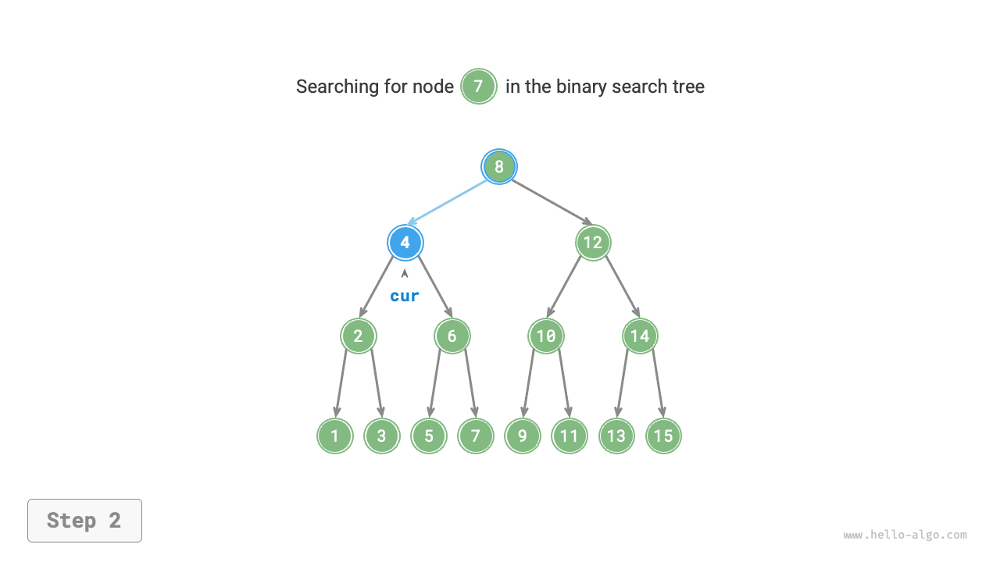
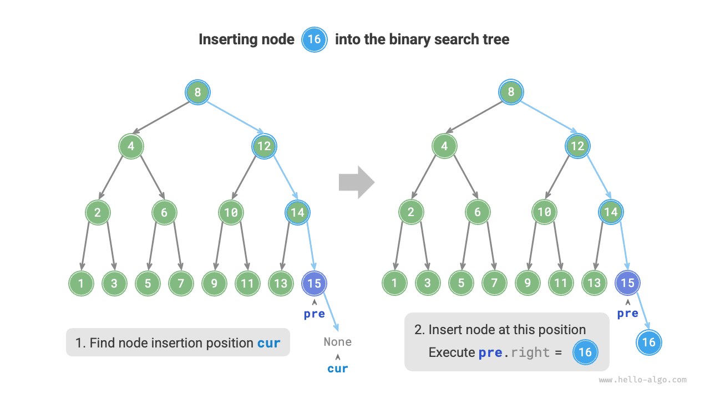
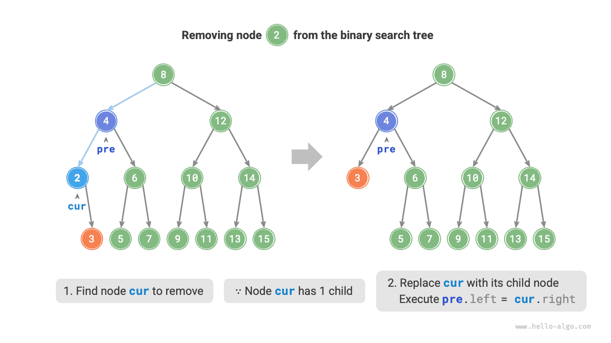
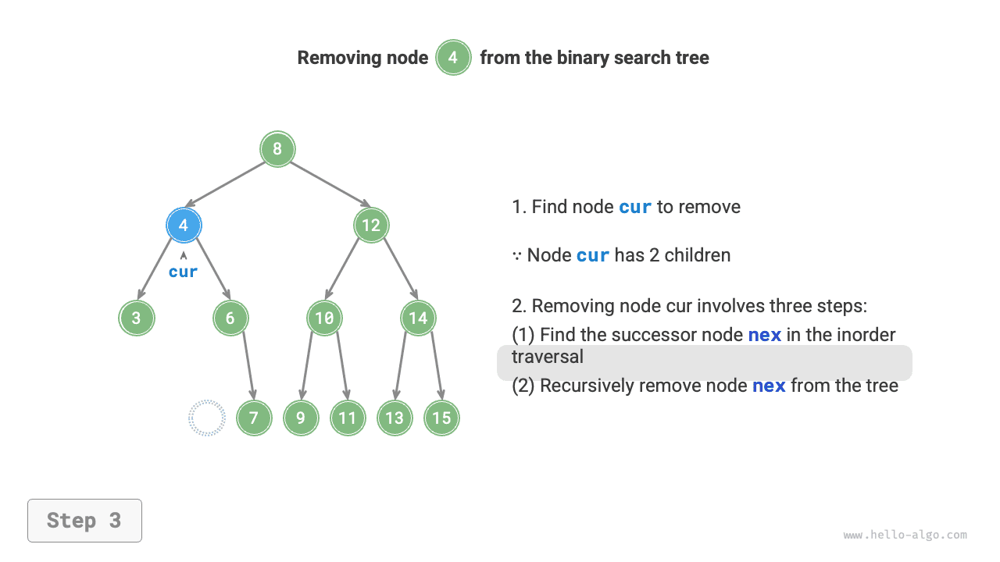

# Cây tìm kiếm nhị phân

Như minh hoạ trong hình dưới đây, <u>cây tìm kiếm nhị phân (binary search tree)</u> thoả mãn các điều kiện sau:

1. Đối với nút gốc, giá trị của mọi nút trong cây con trái $<$ giá trị của nút gốc $<$ giá trị của mọi nút trong cây con phải.
2. Cây con trái và cây con phải của một nút bất kỳ cũng là các cây tìm kiếm nhị phân, tức là cũng thoả mãn điều kiện `1.`.


## Các thao tác trên cây tìm kiếm nhị phân

Chúng ta đóng gói cây tìm kiếm nhị phân thành một lớp `BinarySearchTree`, và khai báo một biến thành viên `root` trỏ tới nút gốc của cây.

### Tìm kiếm nút

Cho giá trị nút mục tiêu `num`, chúng ta có thể dựa vào tính chất của cây tìm kiếm nhị phân để tìm kiếm. Như minh hoạ trong hình dưới đây, ta khai báo một con trỏ nút `cur`, bắt đầu từ nút gốc `root` của cây nhị phân, lặp lại việc so sánh quan hệ độ lớn giữa giá trị nút `cur.val` và `num`:

- Nếu `cur.val < num`, chứng tỏ nút mục tiêu nằm trong cây con phải của `cur`, vì vậy thực hiện `cur = cur.right`.
- Nếu `cur.val > num`, chứng tỏ nút mục tiêu nằm trong cây con trái của `cur`, vì vậy thực hiện `cur = cur.left`.
- Nếu `cur.val = num`, chứng tỏ đã tìm thấy nút mục tiêu, thoát khỏi vòng lặp và trả về nút đó.

=== "<1>"
    

=== "<2>"
    

=== "<3>"
    

=== "<4>"
    

Thao tác tìm kiếm của cây tìm kiếm nhị phân có nguyên lý hoạt động nhất quán với thuật toán tìm kiếm nhị phân, mỗi vòng lặp đều loại bỏ một nửa các trường hợp. Số lần lặp tối đa bằng chiều cao của cây nhị phân, khi cây nhị phân cân bằng, thao tác này mất thời gian $O(\log n)$. Mã nguồn ví dụ như sau:

```src
[file]{binary_search_tree}-[class]{binary_search_tree}-[func]{search}
```

### Chèn nút

Cho một phần tử cần chèn `num`, để duy trì tính chất "cây con trái < nút gốc < cây con phải" của cây tìm kiếm nhị phân, quy trình thao tác chèn được thể hiện như hình dưới đây:

1. **Tìm vị trí chèn**: Tương tự như thao tác tìm kiếm, bắt đầu từ nút gốc, so sánh quan hệ độ lớn giữa giá trị nút hiện tại và `num` để lặp dần xuống dưới, cho đến khi vượt qua nút lá (duyệt đến `None` ) thì thoát khỏi vòng lặp.
2. **Chèn nút tại vị trí đó**: Khởi tạo nút `num`, đặt nút này vào vị trí `None` đó.



Trong hiện thực mã nguồn, cần lưu ý hai điểm sau:

- Cây tìm kiếm nhị phân không cho phép tồn tại các nút trùng lặp, nếu không sẽ vi phạm định nghĩa của nó. Vì vậy, nếu nút cần chèn đã tồn tại trong cây thì không thực hiện chèn mà trực tiếp trả về.
- Để thực hiện việc chèn nút, chúng ta cần nhờ nút `pre` để lưu lại nút của vòng lặp trước đó. Nhờ vậy khi duyệt đến `None`, chúng ta có thể lấy được nút cha của nó, từ đó hoàn thành thao tác chèn nút.

```src
[file]{binary_search_tree}-[class]{binary_search_tree}-[func]{insert}
```

Tương tự như thao tác tìm kiếm nút, việc chèn nút mất thời gian $O(\log n)$.

### Xoá nút

Trước tiên tìm kiếm nút mục tiêu trong cây nhị phân, sau đó xoá nó đi. Tương tự như thao tác chèn nút, chúng ta cần đảm bảo sau khi hoàn thành thao tác xoá, tính chất "cây con trái < nút gốc < cây con phải" của cây tìm kiếm nhị phân vẫn được thoả mãn. Vì vậy, chúng ta dựa theo số lượng nút con của nút mục tiêu, chia thành 3 trường hợp bậc là 0, 1 và 2 để thực hiện thao tác xoá tương ứng:

Như minh hoạ trong hình dưới đây, khi bậc của nút cần xoá là $0$, biểu thị nút đó là nút lá, có thể trực tiếp xoá bỏ.


Như minh hoạ trong hình dưới đây, khi bậc của nút cần xoá là $1$, chỉ cần thay thế nút cần xoá bằng nút con duy nhất của nó.



Khi bậc của nút cần xoá là $2$, chúng ta không thể trực tiếp xoá nó mà cần phải dùng một nút khác để thay thế vị trí của nó. Nhằm duy trì tính chất "cây con trái $<$ nút gốc $<$ cây con phải" của cây tìm kiếm nhị phân, **nút thay thế này có thể là nút nhỏ nhất của cây con phải hoặc nút lớn nhất của cây con trái**.

Giả sử chúng ta chọn nút nhỏ nhất của cây con phải (nút kế tiếp trong chuỗi duyệt trung thứ tự), quy trình thao tác xoá được thể hiện như hình dưới đây:

1. Tìm nút kế tiếp của nút cần xoá trong "chuỗi duyệt trung thứ tự", ghi nhận là `tmp`.
2. Dùng giá trị của `tmp` để ghi đè lên giá trị của nút cần xoá, sau đó xoá đệ quy nút `tmp` khỏi cây.

=== "<1>"
    

=== "<2>"
    

=== "<3>"
    

=== "<4>"
    

Thao tác xoá nút tương tự cũng mất thời gian $O(\log n)$, trong đó việc tìm nút cần xoá mất thời gian $O(\log n)$, và việc lấy nút kế tiếp trong duyệt trung thứ tự mất thời gian $O(\log n)$. Mã nguồn ví dụ như sau:

```src
[file]{binary_search_tree}-[class]{binary_search_tree}-[func]{remove}
```

### Duyệt trung thứ tự có thứ tự tăng dần

Như minh hoạ trong hình dưới đây, duyệt trung thứ tự cây nhị phân tuân theo thứ tự "trái $\rightarrow$ gốc $\rightarrow$ phải", trong khi cây tìm kiếm nhị phân thoả mãn quan hệ độ lớn "nút con trái $<$ nút gốc $<$ nút con phải".

Điều này đồng nghĩa với việc khi thực hiện duyệt trung thứ tự trên cây tìm kiếm nhị phân, chương trình sẽ luôn ưu tiên duyệt nút nhỏ nhất tiếp theo, từ đó dẫn đến một tính chất vô cùng quan trọng: **Chuỗi duyệt trung thứ tự của cây tìm kiếm nhị phân là một dãy tăng dần**.

Tận dụng tính chất tăng dần của duyệt trung thứ tự, việc lấy dữ liệu đã sắp xếp thứ tự trong cây tìm kiếm nhị phân chỉ mất thời gian $O(n)$, không cần phải thực hiện thêm các thao tác sắp xếp bổ sung, vô cùng hiệu quả.


## Hiệu năng của cây tìm kiếm nhị phân

Cho một tập dữ liệu, chúng ta cân nhắc sử dụng mảng hoặc cây tìm kiếm nhị phân để lưu trữ. Quan sát bảng dưới đây, độ phức tạp thời gian của các thao tác trên cây tìm kiếm nhị phân đều thuộc bậc logarit, đem lại hiệu năng ổn định và hiệu quả. Chỉ trong tình huống thêm dữ liệu với tần suất cao nhưng ít khi tìm kiếm và xoá dữ liệu, mảng mới có hiệu năng cao hơn cây tìm kiếm nhị phân.

<p align="center"> Bảng <id> &nbsp; So sánh hiệu năng giữa mảng và cây tìm kiếm nhị phân </p>

|          | Mảng chưa sắp xếp | Cây tìm kiếm nhị phân |
| -------- | -------- | ----------- |
| Tìm kiếm phần tử | $O(n)$   | $O(\log n)$ |
| Chèn phần tử | $O(1)$   | $O(\log n)$ |
| Xoá phần tử | $O(n)$   | $O(\log n)$ |

Trong điều kiện lý tưởng, cây tìm kiếm nhị phân là "cân bằng", nhờ đó có thể tìm kiếm một nút bất kỳ trong tối đa $\log n$ vòng lặp.

Tuy nhiên, nếu chúng ta liên tục chèn và xoá nút trong cây tìm kiếm nhị phân, cây nhị phân có thể thoái hoá thành danh sách liên kết như hình dưới đây, lúc này độ phức tạp thời gian của các thao tác cũng sẽ thoái hoá về $O(n)$.


## Các ứng dụng phổ biến của cây tìm kiếm nhị phân

- Dùng làm chỉ mục đa cấp trong hệ thống để thực hiện các thao tác tìm kiếm, chèn, xoá với hiệu năng cao.
- Làm cấu trúc dữ liệu tầng dưới cho một số thuật toán tìm kiếm.
- Dùng để lưu trữ các luồng dữ liệu (data stream) nhằm duy trì trạng thái có thứ tự của chúng.
