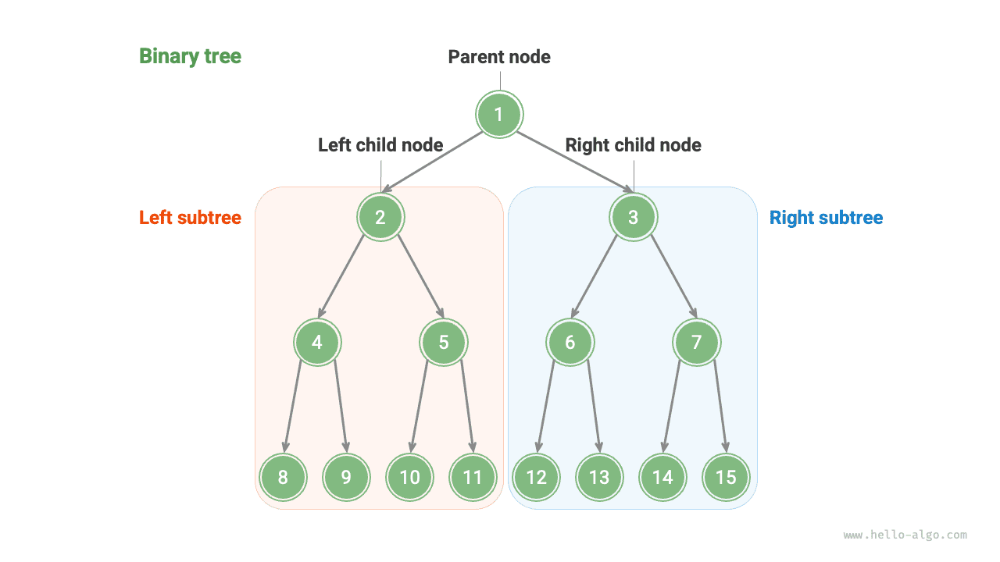
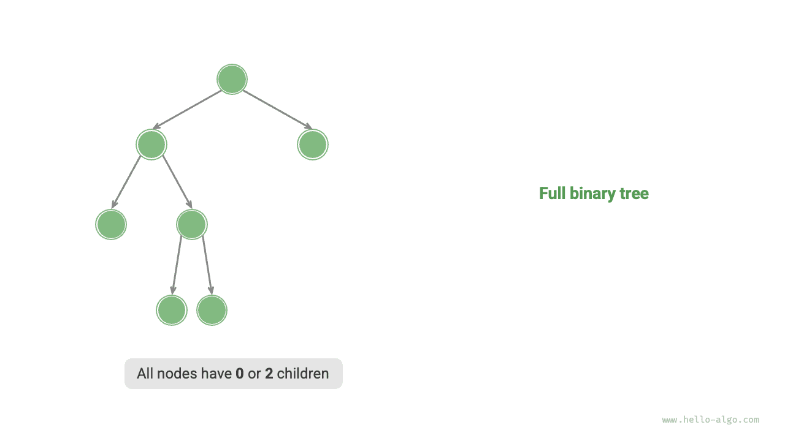

# Cây nhị phân

<u>Cây nhị phân (binary tree)</u> là một cấu trúc dữ liệu phi tuyến tính, biểu diễn mối quan hệ phân cấp giữa "tổ tiên" và "hậu duệ", thể hiện logic chia để trị "một chia làm hai". Tương tự như danh sách liên kết, đơn vị cơ bản của cây nhị phân là nút, mỗi nút bao gồm giá trị, một tham chiếu đến nút con trái và một tham chiếu đến nút con phải.

=== "Python"

    ```python title=""
    class TreeNode:
        """Lớp nút cây nhị phân"""
        def __init__(self, val: int):
            self.val: int = val                # Giá trị nút
            self.left: TreeNode | None = None  # Tham chiếu đến nút con trái
            self.right: TreeNode | None = None # Tham chiếu đến nút con phải
    ```

=== "C++"

    ```cpp title=""
    /* Cấu trúc nút cây nhị phân */
    struct TreeNode {
        int val;          // Giá trị nút
        TreeNode *left;   // Con trỏ đến nút con trái
        TreeNode *right;  // Con trỏ đến nút con phải
        TreeNode(int x) : val(x), left(nullptr), right(nullptr) {}
    };
    ```

=== "Java"

    ```java title=""
    /* Lớp nút cây nhị phân */
    class TreeNode {
        int val;         // Giá trị nút
        TreeNode left;   // Tham chiếu đến nút con trái
        TreeNode right;  // Tham chiếu đến nút con phải
        TreeNode(int x) { val = x; }
    }
    ```

=== "C#"

    ```csharp title=""
    /* Lớp nút cây nhị phân */
    class TreeNode(int? x) {
        public int? val = x;    // Giá trị nút
        public TreeNode? left;  // Tham chiếu đến nút con trái
        public TreeNode? right; // Tham chiếu đến nút con phải
    }
    ```

=== "Go"

    ```go title=""
    /* Cấu trúc nút cây nhị phân */
    type TreeNode struct {
        Val   int
        Left  *TreeNode
        Right *TreeNode
    }
    /* Hàm khởi tạo */
    func NewTreeNode(v int) *TreeNode {
        return &TreeNode{
            Left:  nil, // Con trỏ đến nút con trái
            Right: nil, // Con trỏ đến nút con phải
            Val:   v,   // Giá trị nút
        }
    }
    ```

=== "Swift"

    ```swift title=""
    /* Lớp nút cây nhị phân */
    class TreeNode {
        var val: Int // Giá trị nút
        var left: TreeNode? // Tham chiếu đến nút con trái
        var right: TreeNode? // Tham chiếu đến nút con phải

        init(x: Int) {
            val = x
        }
    }
    ```

=== "JS"

    ```javascript title=""
    /* Lớp nút cây nhị phân */
    class TreeNode {
        val; // Giá trị nút
        left; // Con trỏ đến nút con trái
        right; // Con trỏ đến nút con phải
        constructor(val, left, right) {
            this.val = val === undefined ? 0 : val;
            this.left = left === undefined ? null : left;
            this.right = right === undefined ? null : right;
        }
    }
    ```

=== "TS"

    ```typescript title=""
    /* Lớp nút cây nhị phân */
    class TreeNode {
        val: number;
        left: TreeNode | null;
        right: TreeNode | null;

        constructor(val?: number, left?: TreeNode | null, right?: TreeNode | null) {
            this.val = val === undefined ? 0 : val; // Giá trị nút
            this.left = left === undefined ? null : left; // Tham chiếu đến nút con trái
            this.right = right === undefined ? null : right; // Tham chiếu đến nút con phải
        }
    }
    ```

=== "Dart"

    ```dart title=""
    /* Lớp nút cây nhị phân */
    class TreeNode {
      int val;         // Giá trị nút
      TreeNode? left;  // Tham chiếu đến nút con trái
      TreeNode? right; // Tham chiếu đến nút con phải
      TreeNode(this.val, [this.left, this.right]);
    }
    ```

=== "Rust"

    ```rust title=""
    use std::rc::Rc;
    use std::cell::RefCell;

    /* Cấu trúc nút cây nhị phân */
    struct TreeNode {
        val: i32,                               // Giá trị nút
        left: Option<Rc<RefCell<TreeNode>>>,    // Tham chiếu đến nút con trái
        right: Option<Rc<RefCell<TreeNode>>>,   // Tham chiếu đến nút con phải
    }

    impl TreeNode {
        /* Hàm khởi tạo */
        fn new(val: i32) -> Rc<RefCell<Self>> {
            Rc::new(RefCell::new(Self {
                val,
                left: None,
                right: None
            }))
        }
    }
    ```

=== "C"

    ```c title=""
    /* Cấu trúc nút cây nhị phân */
    typedef struct TreeNode {
        int val;                // Giá trị nút
        int height;             // Chiều cao nút
        struct TreeNode *left;  // Con trỏ đến nút con trái
        struct TreeNode *right; // Con trỏ đến nút con phải
    } TreeNode;

    /* Hàm khởi tạo */
    TreeNode *newTreeNode(int val) {
        TreeNode *node;

        node = (TreeNode *)malloc(sizeof(TreeNode));
        node->val = val;
        node->height = 0;
        node->left = NULL;
        node->right = NULL;
        return node;
    }
    ```

=== "Kotlin"

    ```kotlin title=""
    /* Lớp nút cây nhị phân */
    class TreeNode(val _val: Int) {  // Giá trị nút
        var left: TreeNode? = null   // Tham chiếu đến nút con trái
        var right: TreeNode? = null  // Tham chiếu đến nút con phải
    }
    ```

=== "Ruby"

    ```ruby title=""
    ### Lớp nút cây nhị phân ###
    class TreeNode
      attr_accessor :val    # Giá trị nút
      attr_accessor :left   # Tham chiếu đến nút con trái
      attr_accessor :right  # Tham chiếu đến nút con phải

      def initialize(val)
        @val = val
      end
    end
    ```

Mỗi nút đều có hai tham chiếu (con trỏ), lần lượt trỏ tới <u>nút con trái (left-child node)</u> và <u>nút con phải (right-child node)</u>, nút này được gọi là <u>nút cha (parent node)</u> của hai nút con đó. Khi cho một nút bất kỳ trong cây nhị phân, ta gọi cây tạo bởi nút con trái cùng các nút bên dưới nó là <u>cây con trái (left subtree)</u> của nút đó; tương tự ta có <u>cây con phải (right subtree)</u>.

**Trong cây nhị phân, ngoại trừ nút lá, mọi nút khác đều chứa các nút con và cây con không rỗng**. Như minh hoạ trong hình dưới đây, nếu coi "nút 2" là nút cha, thì nút con trái và nút con phải của nó lần lượt là "nút 4" và "nút 5", cây con trái là "cây tạo bởi nút 4 cùng các nút bên dưới nó", cây con phải là "cây tạo bởi nút 5 cùng các nút bên dưới nó".



## Các thuật ngữ thường gặp của cây nhị phân

Các thuật ngữ thường dùng của cây nhị phân được minh hoạ trong hình dưới đây:

- <u>Nút gốc (root node)</u>: Nút nằm ở tầng cao nhất của cây nhị phân, không có nút cha.
- <u>Nút lá (leaf node)</u>: Nút không có bất kỳ nút con nào, cả hai con trỏ của nó đều trỏ tới `None` (hoặc `NULL`).
- <u>Cạnh (edge)</u>: Đoạn thẳng nối liền hai nút, chính là tham chiếu (con trỏ) giữa các nút.
- <u>Tầng (level)</u> của nút: Tăng dần từ trên đỉnh xuống dưới đáy, tầng của nút gốc là 1.
- <u>Bậc (degree)</u> của nút: Số lượng nút con của nút đó. Trong cây nhị phân, bậc có các giá trị khả dĩ là 0, 1 hoặc 2.
- <u>Chiều cao (height)</u> của cây nhị phân: Số lượng cạnh đi qua từ nút gốc đến nút lá xa nhất.
- <u>Độ sâu (depth)</u> của nút: Số lượng cạnh đi qua từ nút gốc đến nút đó.
- <u>Chiều cao (height)</u> của nút: Số lượng cạnh đi qua từ nút lá xa nhất đến nút đó.


!!! tip

    Xin lưu ý rằng chúng ta thường định nghĩa "chiều cao" và "độ sâu" là "số lượng cạnh đi qua", nhưng trong một số bài tập hoặc giáo trình khác có thể định nghĩa là "số lượng nút đi qua". Trong trường hợp đó, cả chiều cao và độ sâu đều cần cộng thêm 1.

## Các thao tác cơ bản trên cây nhị phân

### Khởi tạo cây nhị phân

Tương tự như danh sách liên kết, trước tiên ta khởi tạo các nút, sau đó thiết lập các tham chiếu (con trỏ) giữa chúng:

=== "Python"

    ```python title="binary_tree.py"
    # Khởi tạo cây nhị phân
    # Khởi tạo các nút
    n1 = TreeNode(val=1)
    n2 = TreeNode(val=2)
    n3 = TreeNode(val=3)
    n4 = TreeNode(val=4)
    n5 = TreeNode(val=5)
    # Thiết lập liên kết giữa các nút
    n1.left = n2
    n1.right = n3
    n2.left = n4
    n2.right = n5
    ```

=== "C++"

    ```cpp title="binary_tree.cpp"
    /* Khởi tạo cây nhị phân */
    // Khởi tạo các nút
    TreeNode* n1 = new TreeNode(1);
    TreeNode* n2 = new TreeNode(2);
    TreeNode* n3 = new TreeNode(3);
    TreeNode* n4 = new TreeNode(4);
    TreeNode* n5 = new TreeNode(5);
    // Thiết lập liên kết giữa các nút
    n1->left = n2;
    n1->right = n3;
    n2->left = n4;
    n2->right = n5;
    ```

=== "Java"

    ```java title="binary_tree.java"
    /* Khởi tạo cây nhị phân */
    // Khởi tạo các nút
    TreeNode n1 = new TreeNode(1);
    TreeNode n2 = new TreeNode(2);
    TreeNode n3 = new TreeNode(3);
    TreeNode n4 = new TreeNode(4);
    TreeNode n5 = new TreeNode(5);
    // Thiết lập liên kết giữa các nút
    n1.left = n2;
    n1.right = n3;
    n2.left = n4;
    n2.right = n5;
    ```

=== "C#"

    ```csharp title="binary_tree.cs"
    /* Khởi tạo cây nhị phân */
    // Khởi tạo các nút
    TreeNode n1 = new(1);
    TreeNode n2 = new(2);
    TreeNode n3 = new(3);
    TreeNode n4 = new(4);
    TreeNode n5 = new(5);
    // Thiết lập liên kết giữa các nút
    n1.left = n2;
    n1.right = n3;
    n2.left = n4;
    n2.right = n5;
    ```

=== "Go"

    ```go title="binary_tree.go"
    /* Khởi tạo cây nhị phân */
    // Khởi tạo các nút
    n1 := NewTreeNode(1)
    n2 := NewTreeNode(2)
    n3 := NewTreeNode(3)
    n4 := NewTreeNode(4)
    n5 := NewTreeNode(5)
    // Thiết lập liên kết giữa các nút
    n1.Left = n2
    n1.Right = n3
    n2.Left = n4
    n2.Right = n5
    ```

=== "Swift"

    ```swift title="binary_tree.swift"
    /* Khởi tạo cây nhị phân */
    // Khởi tạo các nút
    let n1 = TreeNode(x: 1)
    let n2 = TreeNode(x: 2)
    let n3 = TreeNode(x: 3)
    let n4 = TreeNode(x: 4)
    let n5 = TreeNode(x: 5)
    // Thiết lập liên kết giữa các nút
    n1.left = n2
    n1.right = n3
    n2.left = n4
    n2.right = n5
    ```

=== "JS"

    ```javascript title="binary_tree.js"
    /* Khởi tạo cây nhị phân */
    // Khởi tạo các nút
    let n1 = new TreeNode(1),
        n2 = new TreeNode(2),
        n3 = new TreeNode(3),
        n4 = new TreeNode(4),
        n5 = new TreeNode(5);
    // Thiết lập liên kết giữa các nút
    n1.left = n2;
    n1.right = n3;
    n2.left = n4;
    n2.right = n5;
    ```

=== "TS"

    ```typescript title="binary_tree.ts"
    /* Khởi tạo cây nhị phân */
    // Khởi tạo các nút
    let n1 = new TreeNode(1),
        n2 = new TreeNode(2),
        n3 = new TreeNode(3),
        n4 = new TreeNode(4),
        n5 = new TreeNode(5);
    // Thiết lập liên kết giữa các nút
    n1.left = n2;
    n1.right = n3;
    n2.left = n4;
    n2.right = n5;
    ```

=== "Dart"

    ```dart title="binary_tree.dart"
    /* Khởi tạo cây nhị phân */
    // Khởi tạo các nút
    TreeNode n1 = TreeNode(1);
    TreeNode n2 = TreeNode(2);
    TreeNode n3 = TreeNode(3);
    TreeNode n4 = TreeNode(4);
    TreeNode n5 = TreeNode(5);
    // Thiết lập liên kết giữa các nút
    n1.left = n2;
    n1.right = n3;
    n2.left = n4;
    n2.right = n5;
    ```

=== "Rust"

    ```rust title="binary_tree.rs"
    /* Khởi tạo cây nhị phân */
    // Khởi tạo các nút
    let n1 = TreeNode::new(1);
    let n2 = TreeNode::new(2);
    let n3 = TreeNode::new(3);
    let n4 = TreeNode::new(4);
    let n5 = TreeNode::new(5);
    // Thiết lập liên kết giữa các nút
    n1.borrow_mut().left = Some(n2.clone());
    n1.borrow_mut().right = Some(n3);
    n2.borrow_mut().left = Some(n4);
    n2.borrow_mut().right = Some(n5);
    ```

=== "C"

    ```c title="binary_tree.c"
    /* Khởi tạo cây nhị phân */
    // Khởi tạo các nút
    TreeNode *n1 = newTreeNode(1);
    TreeNode *n2 = newTreeNode(2);
    TreeNode *n3 = newTreeNode(3);
    TreeNode *n4 = newTreeNode(4);
    TreeNode *n5 = newTreeNode(5);
    // Thiết lập liên kết giữa các nút
    n1->left = n2;
    n1->right = n3;
    n2->left = n4;
    n2->right = n5;
    ```

=== "Kotlin"

    ```kotlin title="binary_tree.kt"
    /* Khởi tạo cây nhị phân */
    // Khởi tạo các nút
    val n1 = TreeNode(1)
    val n2 = TreeNode(2)
    val n3 = TreeNode(3)
    val n4 = TreeNode(4)
    val n5 = TreeNode(5)
    // Thiết lập liên kết giữa các nút
    n1.left = n2
    n1.right = n3
    n2.left = n4
    n2.right = n5
    ```

=== "Ruby"

    ```ruby title="binary_tree.rb"
    # Khởi tạo cây nhị phân
    # Khởi tạo các nút
    n1 = TreeNode.new(1)
    n2 = TreeNode.new(2)
    n3 = TreeNode.new(3)
    n4 = TreeNode.new(4)
    n5 = TreeNode.new(5)
    # Thiết lập liên kết giữa các nút
    n1.left = n2
    n1.right = n3
    n2.left = n4
    n2.right = n5
    ```

??? pythontutor "Trực quan hoá thực thi"

    https://pythontutor.com/render.html#code=class%20TreeNode%3A%0A%20%20%20%20%22%22%22%E4%BA%8C%E5%8F%89%E6%A0%91%E8%8A%82%E7%82%B9%E7%B1%BB%22%22%22%0A%20%20%20%20def%20__init__%28self,%20val%3A%20int%29%3A%0A%20%20%20%20%20%20%20%20self.val%3A%20int%20%3D%20val%20%20%20%20%20%20%20%20%20%20%20%20%20%20%20%20%23%20%E8%8A%82%E7%82%B9%E5%80%BC%0A%20%20%20%20%20%20%20%20self.left%3A%20TreeNode%20%7C%20None%20%3D%20None%20%20%23%20%E5%B7%A6%E5%AD%90%E8%8A%82%E7%82%B9%E5%BC%95%E7%94%A8%0A%20%20%20%20%20%20%20%20self.right%3A%20TreeNode%20%7C%20None%20%3D%20None%20%23%20%E5%8F%B3%E5%AD%90%E8%8A%82%E7%82%B9%E5%BC%95%E7%94%A8%0A%0A%22%22%22Driver%20Code%22%22%22%0Aif%20__name__%20%3D%3D%20%22__main__%22%3A%0A%20%20%20%20%23%20%E5%88%9D%E5%A7%8B%E5%8C%96%E4%BA%8C%E5%8F%89%E6%A0%91%0A%20%20%20%20%23%20%E5%88%9D%E5%A7%8B%E5%8C%96%E8%8A%82%E7%82%B9%0A%20%20%20%20n1%20%3D%20TreeNode%28val%3D1%29%0A%20%20%20%20n2%20%3D%20TreeNode%28val%3D2%29%0A%20%20%20%20n3%20%3D%20TreeNode%28val%3D3%29%0A%20%20%20%20n4%20%3D%20TreeNode%28val%3D4%29%0A%20%20%20%20n5%20%3D%20TreeNode%28val%3D5%29%0A%20%20%20%20%23%20%E6%9E%84%E5%BB%BA%E8%8A%82%E7%82%B9%E4%B9%8B%E9%97%B4%E7%9A%84%E5%BC%95%E7%94%A8%EF%BC%88%E6%8C%87%E9%92%88%EF%BC%89%0A%20%20%20%20n1.left%20%3D%20n2%0A%20%20%20%20n1.right%20%3D%20n3%0A%20%20%20%20n2.left%20%3D%20n4%0A%20%20%20%20n2.right%20%3D%20n5&cumulative=false&curInstr=3&heapPrimitives=nevernest&mode=display&origin=opt-frontend.js&py=311&rawInputLstJSON=%5B%5D&textReferences=false

### Chèn và xoá nút

Tương tự như danh sách liên kết, việc chèn và xoá nút trong cây nhị phân có thể thực hiện thông qua việc sửa đổi con trỏ. Hình dưới đây đưa ra một ví dụ:


=== "Python"

    ```python title="binary_tree.py"
    # Chèn và xoá nút
    p = TreeNode(0)
    # Chèn nút P vào giữa n1 -> n2
    n1.left = p
    p.left = n2
    # Xoá nút P
    n1.left = n2
    ```

=== "C++"

    ```cpp title="binary_tree.cpp"
    /* Chèn và xoá nút */
    TreeNode* P = new TreeNode(0);
    // Chèn nút P vào giữa n1 -> n2
    n1->left = P;
    P->left = n2;
    // Xoá nút P
    n1->left = n2;
    // Giải phóng bộ nhớ
    delete P;
    ```

=== "Java"

    ```java title="binary_tree.java"
    TreeNode P = new TreeNode(0);
    // Chèn nút P vào giữa n1 -> n2
    n1.left = P;
    P.left = n2;
    // Xoá nút P
    n1.left = n2;
    ```

=== "C#"

    ```csharp title="binary_tree.cs"
    /* Chèn và xoá nút */
    TreeNode P = new(0);
    // Chèn nút P vào giữa n1 -> n2
    n1.left = P;
    P.left = n2;
    // Xoá nút P
    n1.left = n2;
    ```

=== "Go"

    ```go title="binary_tree.go"
    /* Chèn và xoá nút */
    // Chèn nút P vào giữa n1 -> n2
    p := NewTreeNode(0)
    n1.Left = p
    p.Left = n2
    // Xoá nút P
    n1.Left = n2
    ```

=== "Swift"

    ```swift title="binary_tree.swift"
    let P = TreeNode(x: 0)
    // Chèn nút P vào giữa n1 -> n2
    n1.left = P
    P.left = n2
    // Xoá nút P
    n1.left = n2
    ```

=== "JS"

    ```javascript title="binary_tree.js"
    /* Chèn và xoá nút */
    let P = new TreeNode(0);
    // Chèn nút P vào giữa n1 -> n2
    n1.left = P;
    P.left = n2;
    // Xoá nút P
    n1.left = n2;
    ```

=== "TS"

    ```typescript title="binary_tree.ts"
    /* Chèn và xoá nút */
    const P = new TreeNode(0);
    // Chèn nút P vào giữa n1 -> n2
    n1.left = P;
    P.left = n2;
    // Xoá nút P
    n1.left = n2;
    ```

=== "Dart"

    ```dart title="binary_tree.dart"
    /* Chèn và xoá nút */
    TreeNode P = new TreeNode(0);
    // Chèn nút P vào giữa n1 -> n2
    n1.left = P;
    P.left = n2;
    // Xoá nút P
    n1.left = n2;
    ```

=== "Rust"

    ```rust title="binary_tree.rs"
    let p = TreeNode::new(0);
    // Chèn nút P vào giữa n1 -> n2
    n1.borrow_mut().left = Some(p.clone());
    p.borrow_mut().left = Some(n2.clone());
    // Xoá nút p
    n1.borrow_mut().left = Some(n2);
    ```

=== "C"

    ```c title="binary_tree.c"
    /* Chèn và xoá nút */
    TreeNode *P = newTreeNode(0);
    // Chèn nút P vào giữa n1 -> n2
    n1->left = P;
    P->left = n2;
    // Xoá nút P
    n1->left = n2;
    // Giải phóng bộ nhớ
    free(P);
    ```

=== "Kotlin"

    ```kotlin title="binary_tree.kt"
    val P = TreeNode(0)
    // Chèn nút P vào giữa n1 -> n2
    n1.left = P
    P.left = n2
    // Xoá nút P
    n1.left = n2
    ```

=== "Ruby"

    ```ruby title="binary_tree.rb"
    # Chèn và xoá nút
    _p = TreeNode.new(0)
    # Chèn nút _p vào giữa n1 -> n2
    n1.left = _p
    _p.left = n2
    # Xoá nút _p
    n1.left = n2
    ```

??? pythontutor "Trực quan hoá thực thi"

    https://pythontutor.com/render.html#code=class%20TreeNode%3A%0A%20%20%20%20%22%22%22%E4%BA%8C%E5%8F%89%E6%A0%91%E8%8A%82%E7%82%B9%E7%B1%BB%22%22%22%0A%20%20%20%20def%20__init__%28self,%20val%3A%20int%29%3A%0A%20%20%20%20%20%20%20%20self.val%3A%20int%20%3D%20val%20%20%20%20%20%20%20%20%20%20%20%20%20%20%20%20%23%20%E8%8A%82%E7%82%B9%E5%80%BC%0A%20%20%20%20%20%20%20%20self.left%3A%20TreeNode%20%7C%20None%20%3D%20None%20%20%23%20%E5%B7%A6%E5%AD%90%E8%8A%82%E7%82%B9%E5%BC%95%E7%94%A8%0A%20%20%20%20%20%20%20%20self.right%3A%20TreeNode%20%7C%20None%20%3D%20None%20%23%20%E5%8F%B3%E5%AD%90%E8%8A%82%E7%82%B9%E5%BC%95%E7%94%A8%0A%0A%22%22%22Driver%20Code%22%22%22%0Aif%20__name__%20%3D%3D%20%22__main__%22%3A%0A%20%20%20%20%23%20%E5%88%9D%E5%A7%8B%E5%8C%96%E4%BA%8C%E5%8F%89%E6%A0%91%0A%20%20%20%20%23%20%E5%88%9D%E5%A7%8B%E5%8C%96%E8%8A%82%E7%82%B9%0A%20%20%20%20n1%20%3D%20TreeNode%28val%3D1%29%0A%20%20%20%20n2%20%3D%20TreeNode%28val%3D2%29%0A%20%20%20%20n3%20%3D%20TreeNode%28val%3D3%29%0A%20%20%20%20n4%20%3D%20TreeNode%28val%3D4%29%0A%20%20%20%20n5%20%3D%20TreeNode%28val%3D5%29%0A%20%20%20%20%23%20%E6%9E%84%E5%BB%BA%E8%8A%82%E7%82%B9%E4%B9%8B%E9%97%B4%E7%9A%84%E5%BC%95%E7%94%A8%EF%BC%88%E6%8C%87%E9%92%88%EF%BC%89%0A%20%20%20%20n1.left%20%3D%20n2%0A%20%20%20%20n1.right%20%3D%20n3%0A%20%20%20%20n2.left%20%3D%20n4%0A%20%20%20%20n2.right%20%3D%20n5%0A%0A%20%20%20%20%23%20%E6%8F%92%E5%85%A5%E4%B8%8E%E5%88%A0%E9%99%A4%E8%8A%82%E7%82%B9%0A%20%20%20%20p%20%3D%20TreeNode%280%29%0A%20%20%20%20%23%20%E5%9C%A8%20n1%20-%3E%20n2%20%E4%B8%AD%E9%97%B4%E6%8F%92%E5%85%A5%E8%8A%82%E7%82%B9%20P%0A%20%20%20%20n1.left%20%3D%20p%0A%20%20%20%20p.left%20%3D%20n2%0A%20%20%20%20%23%20%E5%88%A0%E9%99%A4%E8%8A%82%E7%82%B9%20P%0A%20%20%20%20n1.left%20%3D%20n2&cumulative=false&curInstr=37&heapPrimitives=nevernest&mode=display&origin=opt-frontend.js&py=311&rawInputLstJSON=%5B%5D&textReferences=false

!!! tip

    Cần lưu ý rằng việc chèn nút có thể làm thay đổi cấu trúc logic ban đầu của cây nhị phân, trong khi việc xoá một nút thường đồng nghĩa với việc xoá nút đó cùng toàn bộ cây con bên dưới nó. Do đó trong cây nhị phân, việc chèn và xoá thường được phối hợp thực hiện theo một chuỗi thao tác hoàn chỉnh để đảm bảo ý nghĩa logic thực tế.

## Các loại cây nhị phân phổ biến

### Cây nhị phân hoàn hảo

Như minh hoạ trong hình dưới đây, <u>cây nhị phân hoàn hảo (perfect binary tree)</u> có mọi tầng đều được lấp đầy hoàn toàn các nút. Trong cây nhị phân hoàn hảo, bậc của các nút lá là $0$, và bậc của tất cả các nút còn lại đều là $2$; nếu chiều cao của cây là $h$, thì tổng số nút của cây là $2^{h+1} - 1$, thể hiện mối quan hệ hàm mũ chuẩn mực, phản ánh hiện tượng phân chia tế bào thường thấy trong tự nhiên.

!!! tip

    Xin lưu ý rằng trong một số tài liệu, cây nhị phân hoàn hảo đôi khi còn được gọi là <u>cây nhị phân đầy đủ</u>.


### Cây nhị phân hoàn chỉnh

Như minh hoạ trong hình dưới đây, <u>cây nhị phân hoàn chỉnh (complete binary tree)</u> chỉ cho phép tầng đáy cùng không được lấp đầy hoàn toàn, và các nút ở tầng đáy cùng bắt buộc phải được lấp đầy liên tục từ trái sang phải. Xin lưu ý rằng một cây nhị phân hoàn hảo cũng chính là một cây nhị phân hoàn chỉnh.


### Cây nhị phân đầy đủ

Như minh hoạ trong hình dưới đây, <u>cây nhị phân đầy đủ (full binary tree)</u> ngoại trừ các nút lá, tất cả các nút còn lại đều có đúng hai nút con.



### Cây nhị phân cân bằng

Như minh hoạ trong hình dưới đây, <u>cây nhị phân cân bằng (balanced binary tree)</u> có giá trị tuyệt đối của hiệu chiều cao giữa cây con trái và cây con phải của bất kỳ nút nào không vượt quá 1.


## Sự thoái hoá của cây nhị phân

Hình dưới đây thể hiện cấu trúc lý tưởng và cấu trúc thoái hoá của cây nhị phân. Khi mỗi tầng của cây nhị phân đều được lấp đầy các nút, cây đạt trạng thái "cây nhị phân hoàn hảo"; trong khi tất cả các nút đều lệch về một phía, cây nhị phân sẽ thoái hoá thành "danh sách liên kết".

- Cây nhị phân hoàn hảo là trường hợp lý tưởng, có thể phát huy tối đa ưu thế "chia để trị" của cây nhị phân.
- Danh sách liên kết là một thái cực khác, khi mọi thao tác đều chuyển thành thao tác tuyến tính, độ phức tạp thời gian thoái hoá về $O(n)$.


Như bảng dưới đây, dưới cấu trúc tốt nhất và xấu nhất, số lượng nút lá, tổng số nút, chiều cao của cây nhị phân đạt các giá trị cực đại hoặc cực tiểu:

<p align="center"> Bảng <id> &nbsp; Cấu trúc tốt nhất và xấu nhất của cây nhị phân </p>

|                             | Cây nhị phân hoàn hảo | Danh sách liên kết |
| --------------------------- | ------------------ | ------- |
| Số lượng nút ở tầng thứ $i$ | $2^{i-1}$          | $1$     |
| Số nút lá của cây có chiều cao $h$ | $2^h$              | $1$     |
| Tổng số nút của cây có chiều cao $h$ | $2^{h+1} - 1$      | $h + 1$ |
| Chiều cao của cây có tổng số $n$ nút | $\log_2 (n+1) - 1$ | $n - 1$ |
