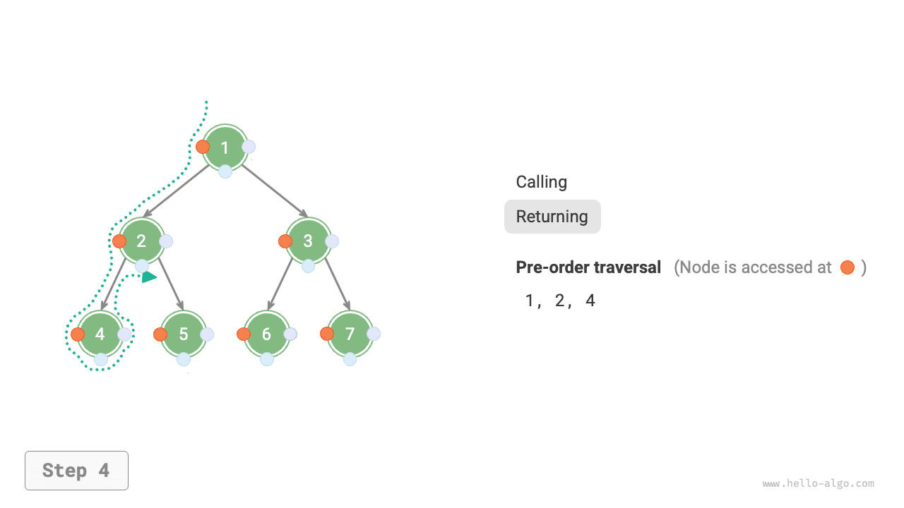
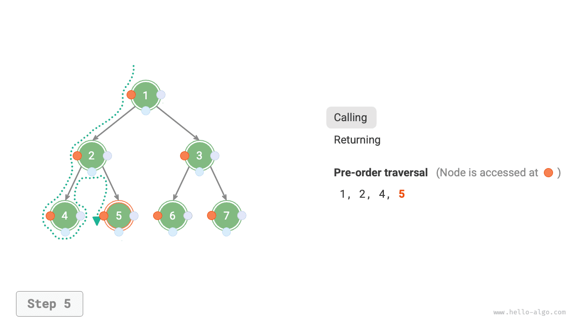
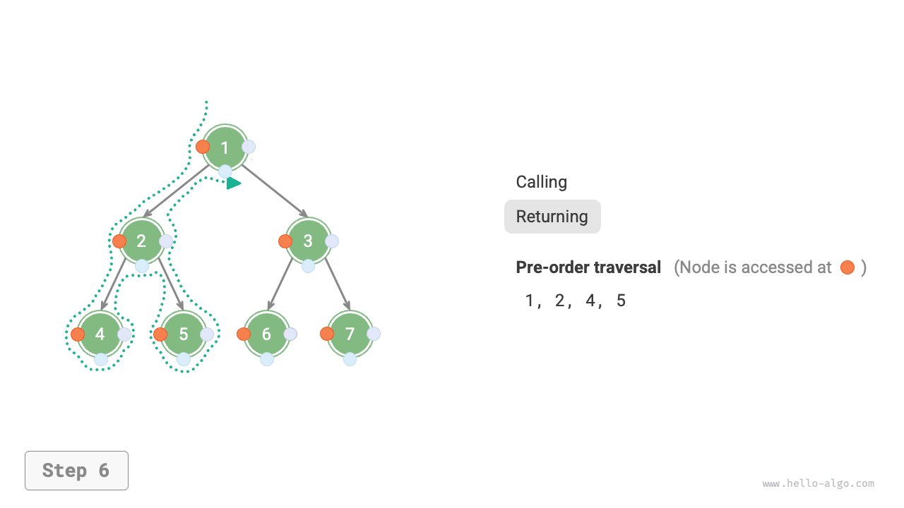
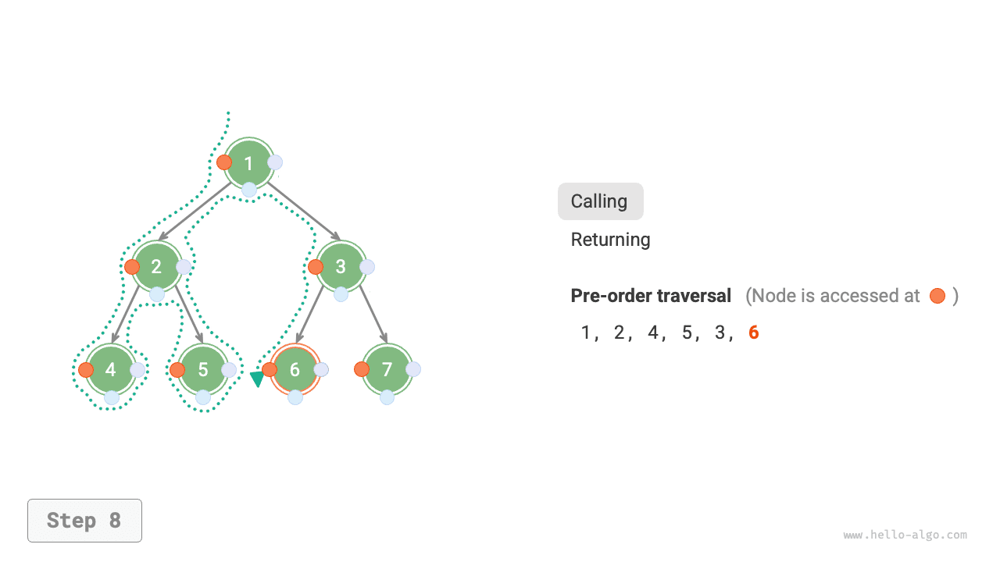
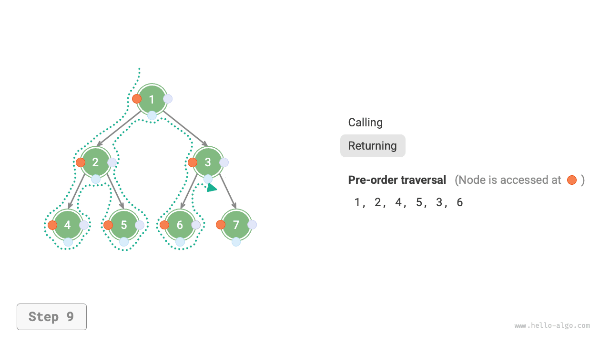

# Duyệt cây nhị phân

Xét từ góc độ cấu trúc vật lý, cây là một cấu trúc dữ liệu dựa trên danh sách liên kết, do đó phương thức duyệt của nó là thông qua con trỏ để lần lượt truy cập từng nút. Tuy nhiên cây là cấu trúc dữ liệu phi tuyến tính, điều này khiến cho việc duyệt cây phức tạp hơn nhiều so với duyệt danh sách liên kết, đòi hỏi phải nhờ đến các thuật toán tìm kiếm.

Các phương thức duyệt cây nhị phân phổ biến bao gồm duyệt theo tầng, duyệt tiền thứ tự, duyệt trung thứ tự và duyệt hậu thứ tự, v.v.

## Duyệt theo tầng

Như minh hoạ trong hình dưới đây, <u>duyệt theo tầng (level-order traversal)</u> tiến hành duyệt cây nhị phân từ trên đỉnh xuống dưới đáy theo từng tầng một, và trong mỗi tầng sẽ truy cập các nút theo thứ tự từ trái sang phải.

Duyệt theo tầng về bản chất thuộc về <u>duyệt theo chiều rộng (breadth-first traversal)</u>, còn được gọi là <u>tìm kiếm theo chiều rộng (breadth-first search, BFS)</u>, nó thể hiện một phương thức duyệt từng tầng một theo hình thức "mở rộng từng vòng từ trong ra ngoài".


### Hiện thực mã nguồn

Duyệt theo chiều rộng thường nhờ vào "hàng đợi" để hiện thực. Hàng đợi tuân theo quy tắc "vào trước ra trước", trong khi duyệt theo chiều rộng tuân theo quy tắc "tiến dần từng tầng", tư tưởng cốt lõi đằng sau cả hai là hoàn toàn nhất quán. Mã nguồn hiện thực như sau:

```src
[file]{binary_tree_bfs}-[class]{}-[func]{level_order}
```

### Phân tích độ phức tạp

- **Độ phức tạp thời gian là $O(n)$**: Toàn bộ các nút đều được truy cập đúng một lần, mất thời gian $O(n)$, trong đó $n$ là số lượng nút.
- **Độ phức tạp không gian là $O(n)$**: Trong trường hợp xấu nhất, tức là cây nhị phân hoàn hảo, trước khi duyệt đến tầng đáy cùng, trong hàng đợi có thể cùng lúc chứa tối đa $(n + 1) / 2$ nút, chiếm dụng không gian $O(n)$.

## Duyệt tiền thứ tự, trung thứ tự và hậu thứ tự

Tương ứng, duyệt tiền thứ tự, trung thứ tự và hậu thứ tự đều thuộc về <u>duyệt theo chiều sâu (depth-first traversal)</u>, còn được gọi là <u>tìm kiếm theo chiều sâu (depth-first search, DFS)</u>, nó thể hiện một phương thức duyệt "đi đến tận cùng rồi mới quay lui tiếp tục".

Hình dưới đây minh hoạ nguyên lý hoạt động của việc duyệt theo chiều sâu trên cây nhị phân. **Duyệt theo chiều sâu tựa như việc "đi một vòng" men theo đường viền ngoài của toàn bộ cây nhị phân**, tại mỗi nút ta đều bắt gặp ba vị trí tương ứng với duyệt tiền thứ tự, duyệt trung thứ tự và duyệt hậu thứ tự.


### Hiện thực mã nguồn

Tìm kiếm theo chiều sâu thường được hiện thực dựa trên đệ quy:

```src
[file]{binary_tree_dfs}-[class]{}-[func]{post_order}
```

!!! tip

    Tìm kiếm theo chiều sâu cũng có thể hiện thực dựa trên vòng lặp lặp đi lặp lại (iteration), bạn đọc quan tâm có thể tự tìm hiểu thêm.

Hình dưới đây minh hoạ quá trình đệ quy khi duyệt tiền thứ tự cây nhị phân, có thể chia thành hai phần ngược chiều nhau là "gọi vào" (descending/đệ quy đi tới) và "trở về" (returning/thu hồi).

1. "Gọi vào" biểu thị việc gọi hàm mới, chương trình trong quá trình này sẽ truy cập nút tiếp theo.
2. "Trở về" biểu thị hàm trả về, đại diện cho việc nút hiện tại đã hoàn tất quá trình xử lý truy cập.

=== "<1>"
    

=== "<2>"
    

=== "<3>"
    

=== "<4>"
    

=== "<5>"
    

=== "<6>"
    

=== "<7>"
    

=== "<8>"
    

=== "<9>"
    

=== "<10>"
    

=== "<11>"
    

### Phân tích độ phức tạp

- **Độ phức tạp thời gian là $O(n)$**: Toàn bộ các nút đều được truy cập đúng một lần, mất thời gian $O(n)$.
- **Độ phức tạp không gian là $O(n)$**: Trong trường hợp xấu nhất, tức là cây thoái hoá thành danh sách liên kết, độ sâu đệ quy đạt đến $n$, hệ thống chiếm dụng không gian khung ngăn xếp (stack frame) $O(n)$.
